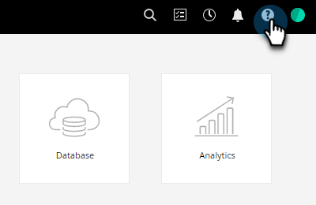
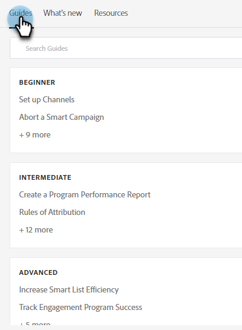

# 帮助中心 {#help-center}

Marketo Engage的「說明中心」是取得協助的集中位置。 除了連結至各種資源(例如 [產品檔案](/help/marketo/home.md){target="_blank"}, [release information](/help/marketo/release-notes/current.md){target="_blank"}, the [Marketo Community](https://nation.marketo.com/){target="_blank"})，即可存取按體驗層級組織的實用產品內逐步說明。

## 如何存取 {#how-to-access}

登入Marketo Engage後，按一下「說明」圖示。

**指南**

指南可作為常用功能的快速逐步說明。

按一下所需的指南進行檢視。

按一下 **開始使用**.

按一下 **下一個** 以繼續。

按一下 **完成** 以結束逐步解說。

>[!TIP]
>
>隨時按一下以退出指南 **解除**.

**新增功能**

「新增功能」標籤包含Marketo Engage最新版本的完整詳細資料。

>[!TIP]
>
>按一下底部的箭頭圖示，以Experience League檢視頁面。

**資源**

「資源」標籤可讓您快速而直接地存取各種方式，以取得Marketo Engage執行個體的額外協助。

