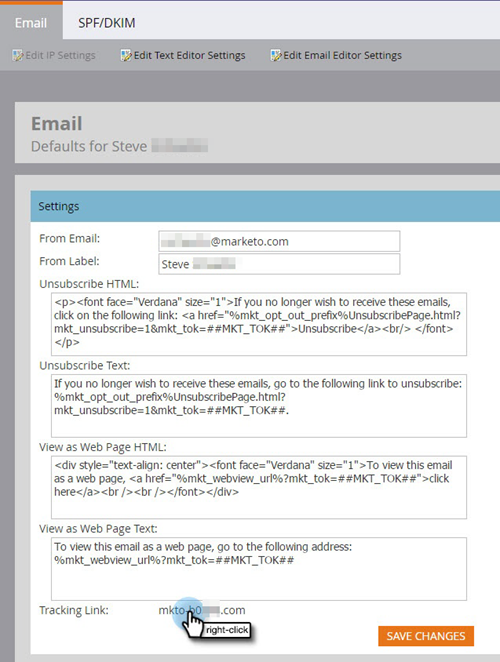

# 设置步骤 {#setup-steps}

**欢迎使用 Adobe Marketo Engage！**

在开始使用Marketo之前，您需要完成以下几个步骤。

这些步骤包括：

* 一些基本帐户设置
* 将您的登陆页面URL和电子邮件链接品牌化，以提高信任度和可投放性
* 同步您的 CRM 系统
* 将跟踪代码添加到您的公司网站

>[!NOTE]
>
>只有在您的公司&#x200B;**首次使用 Marketo** 时，才需要完成这些步骤。如果不是首次使用，这些设置可能已经完成。

部分步骤需要 IT 团队的协助完成。

>[!TIP]
>
>如果您[打印此核对清单](/help/marketo/getting-started/initial-setup/setup-checklist.md){target="_blank"}，则可以在完成项目时将其签出。

## 登录并创建其他Marketo用户 {#log-in-and-create-additional-marketo-users}

>[!IMPORTANT]
>
>如果您的Marketo订阅是在2023年7月31日/之后创建的，或者已迁移到[Adobe Identity Management](/help/marketo/product-docs/administration/marketo-with-adobe-identity/adobe-identity-management-overview.md){target="_blank"}，则下面列出的添加用户的步骤将不适用于您。 请参阅[此文章](/help/marketo/product-docs/administration/marketo-with-adobe-identity/add-or-remove-a-user.md){target="_blank"}。

使用通过电子邮件收到的凭据登录Marketo [此处](https://app.marketo.com/){target="_blank"}。

恭喜！您现在位于Marketo中，可以开始探索。 您可能需要邀请营销团队中的同事加入您。 您可以通过添加新用户来完成此操作。

进入 **[!UICONTROL Admin]** 区域。

>[!TIP]
>
>当您在此时，可以单击&#x200B;**[!UICONTROL My Account]**&#x200B;更改您的帐户和位置设置，以及设置新的订阅名称。

>[!NOTE]
>
>**需要管理员权限**

单击 **[!UICONTROL Users & Roles]**。

单击 **[!UICONTROL Invite New User]**。

填写同事的电子邮件地址、名字和姓氏。 _设置访问过期日期是可选的_。 单击 **[!UICONTROL Next]**。

>[!TIP]
>
>对于短期外部利益相关者或仅需要短期访问Marketo的顾问而言，过期日期非常有用。

>[!NOTE]
>
>到达过期日期时，用户会收到过期通知，并且帐户将被锁定。

选择角色并单击&#x200B;**[!UICONTROL Next]**。 标准用户有权访问除“管理员”之外的所有区域。

>[!NOTE]
>
>除了五个内置角色之外，您还可以创建自定义角色。 了解有关[管理用户角色和权限](/help/marketo/product-docs/administration/users-and-roles/managing-user-roles-and-permissions.md){target="_blank"}的详细信息。

欢迎修改邀请文本。 单击&#x200B;**发送**。

新用户现在列在&#x200B;**[!UICONTROL Users]**&#x200B;选项卡中，并且应该会收到一封电子邮件，其中包含创建密码和登录的链接。 下一步！

## 设置您的授权支持联系人 {#set-up-your-authorized-support-contacts}

您可能已收到Marketo支持部门的一封电子邮件，声明您是贵公司的Marketo客户支持管理员。 如果是，您可以为团队设置&#x200B;**授权支持联系人**。 只有授权支持联系人才能直接通过[Marketo支持门户](https://support.marketo.com){target="_blank"}联系Marketo客户支持。

>[!NOTE]
>
>您可以创建的支持联系人数目取决于您购买的产品包。 此限制在来自Marketo支持的电子邮件中指定。

授权支持联系人文档已移至Marketo社区。 请参阅[此文章](https://nation.marketo.com/t5/Knowledgebase/Managing-Authorized-Support-Contacts/ta-p/254341){target="_blank"}。

>[!NOTE]
>
>只有登录到Marketo社区的用户才会出现在列表中。 如果找不到用户，请确保他们先登录到社区。

## 使用 CNAME 自定义登录页面 URL {#customize-your-landing-page-urls-with-a-cname}

>[!NOTE]
>
>您是 Launch Pack 客户吗？如果是，您可以跳过此步骤。您的顾问将在启动会议中向您提供 IT 设置说明文档。

>[!NOTE]
>
>**需要管理员权限**

为您的登陆页面选择一个 CNAME。示例如下：

    * **go**.[CompanyDomain].com
    * **www2**.[CompanyDomain].com
    * **lp**.[CompanyDomain].com

>[!TIP]
>
>请保持简短！较短的 URL 更容易记忆。我们建议使用 “go” 作为域名前缀。

加粗显示的前半部分即为 `[LandingPageCNAME]`。您将在第 5 步中用到该值。

要检索要用登陆页面CNAME替换的Munchkin ID，请转到管理区域。

点击&#x200B;**我的帐户**。

从登陆页面设置中复制 [!UICONTROL Account String]。

这就是 `[Munchkin ID]`。请将其保存。您需要在第 5 步中将其提供给 IT 团队。

配置域名设置，使登陆页使用您公司的域名，而不是 Marketo 托管时使用的默认域名。

## 确保电子邮件投递成功率 {#ensure-email-deliverability}

>[!NOTE]
>
>您是 Launch Pack 客户吗？如果是，您可以跳过此步骤。您的顾问将在启动会议中向您提供 IT 设置说明文档。

您可以采取多项措施，确保电子邮件尽可能成功送达收件人。

* **为跟踪链接设置品牌化域名**。您可以选择一个 CNAME，在 Marketo 发送的电子邮件链接中使用您自己的域名（而非 Marketo 的域名）。这有助于强化您的域名品牌形象，并提升收件人对电子邮件的信任度和投递成功率。
* **将Marketo添加到您的公司电子邮件允许列表。**&#x200B;向测试帐户发送测试电子邮件之前，向实际用户发送电子邮件是一种常见的最佳做法。 通过将 Marketo 加入允许列表，可以防止这些测试电子邮件被拦截或标记为垃圾电子邮件。
* **设置SPF和DKIM。**&#x200B;这些技术可确保收件人您的Marketo电子邮件不是垃圾邮件。 为避免收件人的垃圾电子邮件过滤器拒收您的 Marketo 电子邮件，请按照以下步骤操作：[设置 SPF 和 DKIM 以提升电子邮件的投递成功率](/help/marketo/product-docs/email-marketing/deliverability/set-up-spf-and-dkim-for-your-email-deliverability.md)。
* **为您的域名设置 MX 记录。** MX 记录可让您接收发送电子邮件所使用域名的来信，以便处理回复和自动回复。如果您使用公司域名发送电子邮件，通常已经配置了该项。如果尚未配置，通常可以将其映射到公司域名的 MX 记录。
* **From 地址的推荐设置。** 在所有电子邮件营销活动中，From 地址必须使用有效、存在且可正常工作的电子邮件域名。相比直接使用公司主域名，从公司域名的子域发送电子邮件通常更有利。这样可以避免公司电子邮件流的问题影响 Marketo 电子邮件流，反之亦然。此外，从 `something@nonexistentdomain.com` 之类不存在的域名发送电子邮件，会导致电子邮件被过滤或拦截。用于发送方 From 地址的任何域名，都必须具备有效且可用的 postmaster@ 和 abuse@ 邮件。

如果您使用 Google Apps 托管公司电子邮件，将无法在域名下直接创建 abuse@ 或 postmaster@ 邮件。为解决这一限制，您需要创建名为“abuse”和“postmaster”的群组。属于这些群组的用户将会收到发送至对应地址（例如 <postmaster@domain.com>）的电子邮件。有关创建群组的详细说明，请参阅[此处](https://support.google.com/a/answer/33343#adminconsole){target="_blank"}。

为电子邮件跟踪链接选择一个 CNAME（务必与第 3 步中为登陆页面选择的 CNAME _不同_）。示例如下：

* go2.[CompanyDomain].com
* em.[CompanyDomain].com
* wow.[CompanyDomain].com

前半部分即为电子邮件跟踪 CNAME，即 `[EmailTrackingCNAME]`。在步骤5中，您需要将它提供给IT。

>[!CAUTION]
>
>电子邮件 CNAME 与登陆页面 CNAME 必须不同。此外，应避免使用诸如 “track” 或 “link” 之类的 CNAME。此类名称通常会被标记为垃圾电子邮件

要查找您的 Marketo 跟踪链接，请前往 **[!UICONTROL Admin]** 区域。

单击 **[!UICONTROL Email]**。

从电子邮件设置中复制 [!UICONTROL Tracking Link]。

[!UICONTROL Tracking Link] 的格式为：`mkto-[a-z][4 digits].com`。

这是您的 `[MktoTrackingLink]`。请将其保存。您需要在第 5 步中将其提供给 IT 团队。

收集 “From” 域名。列出您计划在 Marketo 中用于发送电子邮件的所有 “From” 域名（即 `[Sender]@[FromDomain].com`）。对于大多数组织而言，通常只有一个。

例如，“marketo.com,”“info.marketo.com,”。这些即为 `[FromDomain1]`、`[FromDomain2]` 等。请将这些信息保存下来。您需要在第 5 步中将它们提供给 IT 团队。

至此，您已经具备向 IT 团队提交请求所需的全部信息！

## 请求 IT 配置协议 {#ask-it-to-configure-protocols}

>[!NOTE]
>
>您是 Launch Pack 客户吗？如果是，您可以跳过此步骤。您的顾问将在启动会议中向您提供 IT 设置说明文档。

在收集完所有必要信息后，您就可以向 IT 团队发送请求了。您可以使用下面的文本作为模板，将其中加粗的内容替换为您自己的信息。

[在电子邮件中包含此文章的链接](/help/marketo/getting-started/initial-setup/configure-protocols-for-marketo.md)。

将以下文本粘贴到电子邮件中，并替换其中加粗显示的占位符：

>[!NOTE]
>
>请参考上文第 3 步和第 4 步，以确定需要替换占位符的具体内容。请务必注意，`[LandingPageCNAME]` 和 `[EmailTrackingCNAME]` 必须不同。

`----------------------------------------------`

尊敬的IT管理员：

我们的营销团队目前正在使用 Marketo 平台与客户和受众进行沟通。为确保电子邮件具备良好的投递成功率，我们需要进行以下更改：

`1)`针对我们的登陆页面，请为 **[LandingPageCNAME]** 添加一条 DNS 记录（CNAME）。**[CompanyDomain]**.com，指向 **[Munchkin ID]**.mktoweb.com。

`2)`针对电子邮件中的跟踪链接，请为 **[EmailTrackingCNAME]** 添加一条 DNS 记录（CNAME）。**[CompanyDomain]**.com，指向 **[MktoTrackingLink]**。

`3)` 将 Marketo 加入允许列表。

    * 如果我们的电子邮件允许列表基于 IP 地址，请将以下 IP 添加到允许列表中：
    199.15.212.0/22
    
    192.28.144.0/20
    
    192.28.160.0/19
    
    185.28.196.0/22
    
    130.248.172.0/24
    
    130.248.173.0/24
    
    94.236.119.0/26

>[!NOTE]
>
>如需获取适用于我们环境的精简 IP 允许列表，请联系 Marketo 支持团队。

    * 如果我们的反垃圾电子邮件系统基于 From 域名进行过滤，请添加以下域名：

**`[FromDomain1]`**
**`[FromDomain2]`**

`4)` 我们需要配置 SPF 和 DKIM，以授权 Marketo 代表我们发送带有签名的电子邮件。

`a.` 要设置 SPF，请在我们的 DNS 记录中添加以下内容：

IN  TXT **[From Domain]**:  v=spf1 mx ip4:**[Corporate IP(s)]**
 include: mktomail.com ~all

如果 DNS 中已存在 SPF 记录，请仅将以下内容追加到现有记录中：

include:mktomail.com

`[`请将 **From Domain** 替换为您的电子邮件发送域名（例如 company.com），并将 **CorpIP** 替换为公司电子邮件服务器的 IP 地址（例如 255.255.255.255）。如果您将通过 Marketo 使用多个域名发送电子邮件，请让 IT 人员为每个域名分别添加这一行（每个域名一行）。`]`

`b.` 对于 DKIM，请为我们希望配置的每个域名创建相应的 DNS 资源记录。以下是将用于签名的各个域的主机记录和 TXT 值：

**`[DKIMDomain1]`**：主机记录为&#x200B;**`[HostRecord1]`**，TXT值为&#x200B;**[TXTValue1]**。

**`[DKIMDomain2]`**：主机记录是 **`[HostRecord2]`**，TXT 值为 **`[TXTValue2]`**。

`[`在按照[此处说明](/help/marketo/product-docs/email-marketing/deliverability/set-up-a-custom-dkim-signature.md)完成设置后，请复制每个 **DKIMDomain** 对应的 **HostRecord** 和 **TXTValue**。在 IT 人员完成此步骤后，请务必在&#x200B;**“管理员”>“电子邮件”>“DKIM”**&#x200B;中验证每个域。`]`

`5)`我们需要确保FROM域&#x200B;**[FromDomain1]**、**[FromDomain2]**&#x200B;等存在有效的MX记录。 请协助确认。如果不存在，请配置其映射至公司主域名的 MX 记录。这样可以确保我们能够正常处理 Marketo 电子邮件的回复和自动回复。

请在完成上述步骤后通知我，以便我继续完成 Marketo 的后续设置。

谢谢！非常感谢您的支持！

爱，

**`[Your Name]`**

`----------------------------------------------`

将该电子邮件发送给 IT 团队。我们理解 IT 团队完成这些任务可能需要一些时间。您可以继续执行步骤7，但请记住，您必须返回步骤6以完成Marketo设置。

## 在 IT 完成配置后完成 Marketo 设置 {#complete-your-marketo-setup-after-it-finishes}

在 IT 完成相关配置后，请按照以下步骤添加登陆页面和电子邮件的 CNAME，并启用 DKIM 签名。

前往 **[!UICONTROL Admin]** 区域以添加登陆页面 CNAME。

选择“登陆页面”，并在 [!UICONTROL Settings] 区域中点击 **[!UICONTROL Edit]**。

在 **[!UICONTROL Domain Name for Landing Pages]** 字段中输入您的新域名。其格式应为：

`[LandingPageCNAME].[CompanyDomain].com`

在 **[!UICONTROL Fallback]** 页面字段中，输入当登陆页面不可用时希望用户跳转到的 URL。如果您没有备用页面，可以使用公司官网首页。在 **[!UICONTROL Homepage]** 字段中输入您的公司网站地址。

在 [!UICONTROL Admin] 区域中，选择 **[!UICONTROL Email]** 以添加电子邮件 CNAME。

向下滚动至 [!UICONTROL Branding Domains]。选择您的域名，然后点击 **[!UICONTROL Edit]**。

在“域名”字段中输入您的电子邮件跟踪域名。其格式应为：

`[EmailTrackingCNAME].[CompanyDomain].com`. Click **[!UICONTROL Save]**.

## 集成您的 CRM {#integrate-your-crm}

这可能是设置过程中最令人兴奋的步骤 — 现在该使用Marketo中存储的所有潜在客户和联系人来充实您的了！

根据您公司使用的 CRM，从以下选项中进行选择。

    * [将Marketo与 [!DNL Salesforce.com]集成](/help/marketo/product-docs/crm-sync/salesforce-sync/understanding-the-salesforce-sync.md)
    * [将Marketo与 [!DNL Microsoft Dynamics]集成](/help/marketo/product-docs/crm-sync/microsoft-dynamics-sync/understanding-the-microsoft-dynamics-sync.md)

>[!NOTE]
>
>完成这些步骤需要您公司 CRM 管理员的协助。

## 将跟踪代码添加到您的网站 {#add-tracking-code-to-your-website}

>[!NOTE]
>
>您是 [!DNL Launch Pack] 客户吗？如果是，您可以跳过此步骤。您的顾问将在 IT 设置说明文档中向您提供 [!DNL Munchkin] 代码的相关指引。

Marketo具有自定义跟踪JavaScript（称为[!DNL Munchkin]），可用于跟踪任何网页上的人员活动。 要将您的网站集成到 Marketo 中，必须使用 [!DNL Munchkin]。请按照以下步骤操作：[将 [!DNL Munchkin] 跟踪代码添加到您的网站](/help/marketo/product-docs/administration/additional-integrations/add-munchkin-tracking-code-to-your-website.md){target="_blank"}。

>[!NOTE]
>
>需要具有HTML的体验才能添加跟踪代码。

## 性能预期 {#performance-expectations}

在性能方面，您可以对 Marketo 有哪些预期？这会因营销活动的规模和复杂程度而有所不同。但整体性能可与 [Marketo Engage 产品说明](https://helpx.adobe.com/cn/legal/product-descriptions/adobe-marketo-engage---product-description.html){target="_blank"}中多张表格里“标准”列所描述的性能水平相当。“性能”和“性能提升”列对应的是提供[更高性能水平](https://nation.marketo.com/t5/product-documents/marketo-engage-performance-tiers/ta-p/328835){target="_blank"}的性能等级套餐。

您的所有设置步骤都已结束。 只剩下深入了解并使用Marketo了！
