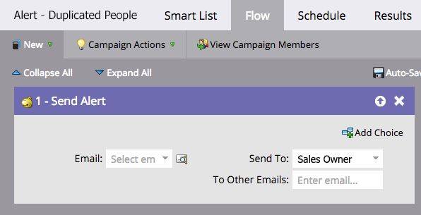

# 自动提醒可能存在重复的人员 {#automate-an-alert-for-possible-duplicate-people}

是否希望每次创建可能的重复人员时发出警报？ 下面是如何设置智能营销活动以执行此操作。

1. [创建新的智能营销活动](/help/marketo/product-docs/core-marketo-concepts/smart-campaigns/creating-a-smart-campaign/create-a-new-smart-campaign.md){target=&quot;_blank&quot;}。 定义以下智能列表：

* 触发器： **已创建人员**
* 过滤器： **复制字段。** 字段名称 **为全名**

   

   >[!TIP]
   >
   >有创造力。 在不同的场下进行实验，获得较好的滤波效果。

1. 在流程步骤中，选择 [发送警报](/help/marketo/product-docs/core-marketo-concepts/smart-campaigns/flow-actions/send-alert.md){target=&quot;_blank&quot;}流操作。

   

   >[!TIP]
   >
   >使用 [发送警报信息令牌](/help/marketo/product-docs/email-marketing/general/using-tokens/use-the-send-alert-info-token.md){target=&quot;_blank&quot;}，以包含指向CRM中人员的链接。

   >[!CAUTION]
   >
   >如果导入一个大列表，您可能会同时获得一堆警报！
   >
   >另外，两个同名的人并不自动表示他们是同一个人。

1. 在 **计划** 选项卡。

   

就这样！ 每次在Marketo中创建现有全名新人员时，此智能营销活动都会触发。

>[!MORELIKETHIS]
>
>[查找并合并重复人员](/help/marketo/product-docs/core-marketo-concepts/smart-lists-and-static-lists/managing-people-in-smart-lists/find-and-merge-duplicate-people.md){target=&quot;_blank&quot;}
