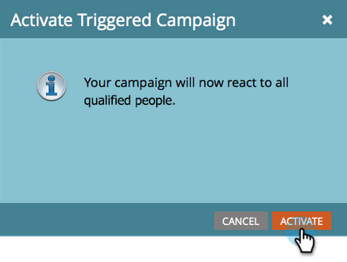

# 提醒销售代表 {#alert-the-sales-rep}

## 任务：当有人在您的网站上填写表单时提醒销售代表 {#mission-alert-the-sales-rep-when-a-person-fills-out-a-form-on-your-web-site}

要自动向销售代表发送警报电子邮件，您只需要一封警报电子邮件和电子邮件促销活动。 下面是操作方法。

>[!PREREQUISITES]
>
>[带有表单的登陆页面](/help/marketo/getting-started/quick-wins/landing-page-with-a-form.md){target="_blank"}

## 步骤1：创建警报电子邮件 {#step-create-an-alert-email}

1. 转到 **[!UICONTROL 营销活动]** 区域。

   

1. 选择 **我的项目** ，您已在 [带有表单的登陆页面](/help/marketo/getting-started/quick-wins/landing-page-with-a-form.md){target="_blank"} 快速获胜，然后位于下方 **[!UICONTROL 新]** 点击 **[!UICONTROL 新建本地资产]**.

   

1. 单击 **[!UICONTROL 电子邮件]**.

   

1. **名称** 电子邮件“我的电子邮件警报”，选择一个模板并单击 **[!UICONTROL 创建]**.

   

1. 输入 **发件人名称**， **发件人电子邮件**， **[!UICONTROL 回复]**、和 **[!UICONTROL 主题]** 您希望销售团队了解的信息。

   

1. 双击以编辑电子邮件文本。

   

1. 键入电子邮件内容。

   

1. 将光标放在要插入人员联系信息的位置，然后单击 **插入令牌** 图标。

   

1. 查找并选择 `{{SP_Send_Alert_Info}}` **[!UICONTROL 令牌]** 并单击 **[!UICONTROL 插入]**.

   

   >[!NOTE]
   >
   >{{SP_Send_Alert_Info}} 是警报电子邮件的特殊令牌。 参见 [使用发送警报信息令牌](/help/marketo/product-docs/email-marketing/general/using-tokens/use-the-send-alert-info-token.md){target="_blank"}{target="_blank"} 了解更多信息。

1. 单击 **[!UICONTROL 保存]**.

   

1. 单击 **[!UICONTROL 电子邮件操作]** 下拉菜单并选择 **[!UICONTROL 批准并关闭]**.

   

## 步骤2：创建警报触发器营销活动 {#step-create-an-alert-trigger-campaign}

1. 选择 **我的项目** 之前创建，然后在 **[!UICONTROL 新]** 点击 **[!UICONTROL 新建智能营销活动]**.

   

1. **名称** 营销活动“我的警报营销活动”，然后单击 **[!UICONTROL 创建]**.

   

1. 在 **[!UICONTROL 智能列表]** 选项卡，查找并拖动 **[!UICONTROL 填写表单]** 触发画布。

   

1. 选择我们之前创建的表单。

   

1. 在 **[!UICONTROL 流量]** 选项卡，查找并拖动 **[!UICONTROL 发送警报]** 流程操作到画布。

   

1. 选择 **[!UICONTROL 我的警报电子邮件]** 之前创建并离开 **[!UICONTROL 发送至]** 作为 **[!UICONTROL 销售负责人]**.

   

1. 在“ ”中输入您的电子邮件地址 **[!UICONTROL 至其他电子邮件]** 字段。

   

1. 转到 **[!UICONTROL 计划]** 选项卡，然后单击 **[!UICONTROL 激活]** 按钮。

   

   >[!TIP]
   >
   >设置 **[!UICONTROL 资格规则]** 到 **[!UICONTROL 每次]** （通过编辑Smart Campaign）以允许同一人员多次触发警报。

1. 单击 **[!UICONTROL 激活]** 确认屏幕上。

   

## 步骤3：测试！ {#step-test-it-out}

1. 选择您的登陆页面并单击 **[!UICONTROL 查看已批准的页面]**.

   

   >[!NOTE]
   >
   >不要忘记批准登陆页面；在获得批准之前，登陆页面不会上线。

1. 填写表单并单击 **[!UICONTROL 提交]**.

   

1. 您很快就会收到电子邮件。 验证所有功能均可正常使用后，从“发送警报”流程中删除您的电子邮件地址（请参阅上面的步骤2.7）。

   >[!NOTE]
   >
   >单击 **[!UICONTROL 人员信息]** Marketo选项卡，以查看联系人信息。

## 任务完成！ {#mission-complete}

  

[◄任务7：个性化电子邮件](/help/marketo/getting-started/quick-wins/personalize-an-email.md)

[任务9：更新人员数据►](/help/marketo/getting-started/quick-wins/update-person-data.md)
