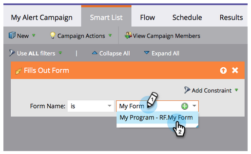
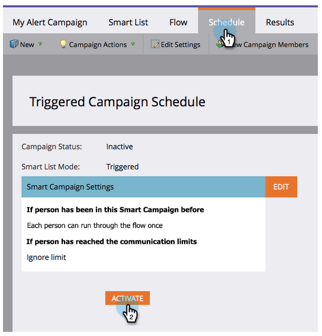

# 提醒销售代表 {#alert-the-sales-rep}

## 任务：当某人在您的网站上填写表单时，提醒销售代表 {#mission-alert-the-sales-rep-when-a-person-fills-out-a-form-on-your-web-site}

要自动向销售代表发送警报电子邮件，您只需发送警报电子邮件和电子邮件营销活动。 这是如何做到的。

>[!PREREQUISITES]
>
>[包含表单的登陆页面](/help/marketo/getting-started/quick-wins/landing-page-with-a-form.md){target=&quot;_blank&quot;}

## 步骤1:创建警报电子邮件 {#step-create-an-alert-email}

1. 转到 **营销活动** 的上界。

   

1. 选择 **我的程序** 在中创建的 [包含表单的登陆页面](/help/marketo/getting-started/quick-wins/landing-page-with-a-form.md){target=&quot;_blank&quot;}快速获胜，然后在 **新建** 单击 **新建本地资产**.

   

1. 单击 **电子邮件**.

   

1. **名称** 电子邮件“我的电子邮件警报”，选择模板并单击 **创建**.

   

1. 输入 **从名称**, **从电子邮件**, **回复**&#x200B;和 **主题** 你希望你的销售团队能看到。

   

1. 双击以编辑电子邮件文本。

   

1. 键入电子邮件内容。

   

1. 将光标放在要插入人员联系信息的位置，然后单击 **插入令牌** 图标。

   

1. 查找并选择 `{{SP_Send_Alert_Info}}` **令牌** 单击 **插入**.

   

   >[!NOTE]
   >
   >{{SP_Send_Alert_Info}} 是警报电子邮件的特殊令牌。 请参阅 [使用发送警报信息令牌](/help/marketo/product-docs/email-marketing/general/using-tokens/use-the-send-alert-info-token.md){target=&quot;_blank&quot;}{target=&quot;_blank&quot;}以了解详情。

1. 单击 **保存**.

   

1. 关闭电子邮件编辑器选项卡/窗口。

   

1. 在 **电子邮件操作** 单击 **批准**.

   

## 步骤2:创建警报触发营销活动 {#step-create-an-alert-trigger-campaign}

1. 选择 **我的程序** 之前创建，然后在下 **新建** 单击 **新的智能营销活动**.

   

1. **名称** 营销活动“我的警报营销活动”，然后单击 **创建**.

   

1. 在 **智能列表** ，查找并拖动 **填写表单** 触发到画布。

   

1. 选择之前创建的表单。

   

1. 在 **流量** ，查找并拖动 **发送警报** “流”操作。

   

1. 选择 **我的警报电子邮件** 创建于早期且保留 **发送至** as **销售所有者**.

   

1. 在 **发送到其他电子邮件** 字段。

   

1. 转到 **计划** ，然后单击 **激活** 按钮。

   

   >[!TIP]
   >
   >设置 **资格规则** to **每次** （通过编辑智能营销活动），以允许同一人多次触发警报。

1. 单击 **激活** 在确认屏幕上。

   

## 步骤3:测试！ {#step-test-it-out}

1. 选择您的登陆页面并单击 **“查看已批准”页面**.

   

   >[!NOTE]
   >
   >不要忘记批准登陆页面；他们直到获得批准才上线。

1. 填写表格并单击 **提交**.

   

1. 您应会很快收到您的电子邮件。 确认一切正常后，从“发送警报”流程中删除您的电子邮件地址（请参阅上面的步骤2.7）。

   >[!NOTE]
   >
   >单击 **人员信息** 选项卡，以查看联系信息。

## 任务完成！ {#mission-complete}

  

[◄任务7:个性化电子邮件](/help/marketo/getting-started/quick-wins/personalize-an-email.md)

[任务9:更新人员数据►](/help/marketo/getting-started/quick-wins/update-person-data.md)
