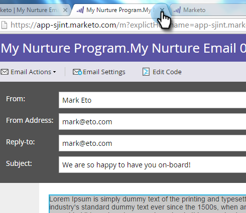
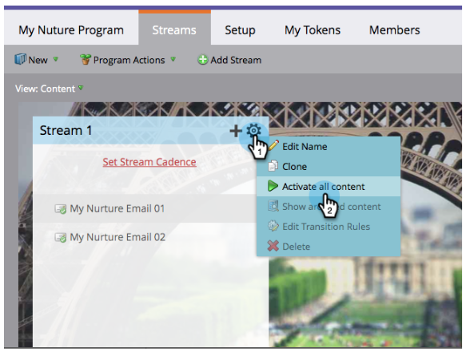
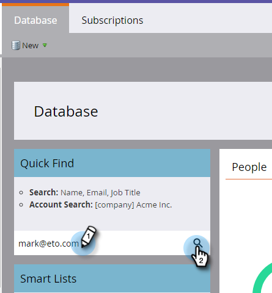

# 滴水，滴水，培养{#drip-drip-nurture}

## 任务：培养最近参加您的贸易展的人{#mission-nurture-the-people-who-attended-your-recent-tradeshow}

您可以在Marketo中轻松创建高级、复杂的培养系统。 这就是方法！

>[!PREREQUISITES]
>
>* [设置并添加人](/help/marketo/getting-started/quick-wins/get-set-up-and-add-a-person.md)
>* [导入人员列表](/help/marketo/getting-started/quick-wins/import-a-list-of-people.md)

## 第1步：创建参与项目{#step-create-an-engagement-program}

1. 转至&#x200B;**营销活动**&#x200B;区域。

   

1. 选择&#x200B;**Learning**&#x200B;文件夹，单击&#x200B;**New**&#x200B;下拉框，然后选择&#x200B;**New 项目**。

   

1. 输入&#x200B;**名称**，然后为&#x200B;**项目类型**&#x200B;选择&#x200B;**参与**。

   

1. 确保&#x200B;**渠道**&#x200B;字段为&#x200B;**Nurture**，然后单击&#x200B;**创建**。

   

   您现在已创建了参与项目。

## 第2步：创建电子邮件{#step-create-an-email}

1. 选择您的参与项目，然后单击&#x200B;**新建**&#x200B;并选择&#x200B;**新建本地资产**。

   

1. 单击&#x200B;**电子邮件**。

   

1. 输入&#x200B;**名称**，选择要使用的&#x200B;**模板**，然后单击&#x200B;**创建**。

   

   >[!NOTE]
   >
   >没有看到电子邮件编辑器？ 您的浏览器可能已阻止该窗口。 在您的浏览器中启用[app.marketo.com](https://app.marketo.com)的弹出窗口，然后单击顶部菜单栏中的&#x200B;**编辑草稿**。

1. 输入主题。

   

1. 选择要编辑的电子邮件区域，单击齿轮图标，然后选择&#x200B;**编辑**。

   

1. 编辑您的电子邮件，然后单击&#x200B;**保存**。

   

1. 关闭电子邮件编辑器选项卡/窗口。

   

1. 在&#x200B;**电子邮件操作**&#x200B;下，单击&#x200B;**批准**。

   

   >[!NOTE]
   >
   >不要忘记批准您的电子邮件，否则您以后将无法激活它们。

1. 现在，通过重复步骤2操作创建另一封电子邮件。

   

## 第3步：将内容添加到流{#step-add-content-to-your-stream}

1. 现在，是时候使用您创建的电子邮件为您的参与项目创建一系列内容了。

1. 选择您的参与项目，然后单击&#x200B;**流**&#x200B;选项卡。

   

1. 将您创建的两封电子邮件拖动到正确的画布上。

   

   >[!TIP]
   >
   >您还可以使用&#x200B;**添加内容**&#x200B;按钮或流&#x200B;**+**&#x200B;图标。

## 第4步：激活流内容{#step-activate-stream-content}

1. 通过单击流齿轮图标一次激活所有内容，然后单击&#x200B;**激活所有内容**。

   

   >[!NOTE]
   >
   >要激活内容，必须先批准。

   干得好！ 再一步，就可以实现参与项目。

## 第5步：设置流节奏{#step-set-the-stream-cadence}

1. 单击&#x200B;**设置流节奏**。

   

1. 编辑设置以匹配所需的计划，然后单击&#x200B;**保存**。

   

   您的参与项目已设置完毕。 现在，让我们将测试人员添加到您的项目。

   >[!NOTE]
   >
   >测试人员是检查您的参与项目，以在发送给客户之前测试其正确性的人员。

## 第6步：将测试人员添加到您的参与项目{#step-add-a-test-person-to-your-engagement-program}

1. 转到&#x200B;**Database**&#x200B;区域。

   

1. 搜索测试人员。

   

   >[!NOTE]
   >
   >确保测试人员具有有效的电子邮件地址，以便您在测试时确认接收电子邮件。

1. 右键单击该人，然后单击“项目”和“添加到参与项目”。

   

1. 选择&#x200B;**项目**&#x200B;和&#x200B;**流**，然后单击&#x200B;**立即运行**。

   

1. 任务完成！

1. 您应在指定的时间和节奏时收到电子邮件。

   >[!NOTE]
   >
   >了解有关[参与项目](/help/marketo/product-docs/email-marketing/drip-nurturing/creating-an-engagement-program/understanding-engagement-programs.md)的更多信息。

  

[◄任务5:导入潜在客户列表](/help/marketo/getting-started/quick-wins/import-a-list-of-people.md)

[任务7:个性化电子邮件►](/help/marketo/getting-started/quick-wins/personalize-an-email.md)
