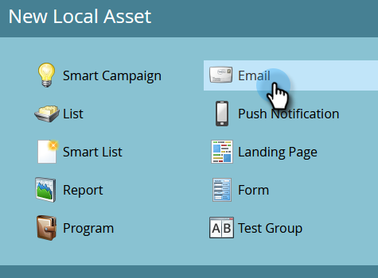
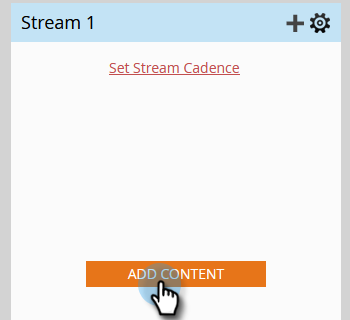

# 滴，滴，抚 {#drip-drip-nurture}

## 任务：培养最近参加你展会的人 {#mission-nurture-the-people-who-attended-your-recent-tradeshow}

您可以轻松地在Marketo中创建高级而复杂的培养系统。 这就是方法！

>[!PREREQUISITES]
>
>* [设置并添加人员](/help/marketo/getting-started/quick-wins/get-set-up-and-add-a-person.md){target=&quot;_blank&quot;}
>* [导入人员列表](/help/marketo/getting-started/quick-wins/import-a-list-of-people.md){target=&quot;_blank&quot;}

## 步骤1:创建参与计划 {#step-create-an-engagement-program}

1. 转到 **营销活动** 的上界。

   

1. 选择 **学习** 文件夹，单击 **新建** 下拉框并选择 **新计划**.

   

1. 输入 **名称** 选择 **参与度** 对于 **程序类型**.

   

1. 确保 **渠道** 字段 **培养** 单击 **创建**.

   

   你现在已经创建了参与计划。

## 步骤2:创建电子邮件 {#step-create-an-email}

1. 选择您的参与计划，单击 **新建** 选择 **新建本地资产**.

   

1. 单击 **电子邮件**.

   

1. 输入 **名称**，选择 **模板** 要使用，请单击 **创建**.

   

   >[!NOTE]
   >
   >没有看到电子邮件编辑器？ 您的浏览器可能已阻止窗口。 启用 `app.marketo.com` 在浏览器中，单击 **编辑草稿** 中。

1. 输入主题。

   

1. 选择要编辑的电子邮件区域，单击齿轮图标，然后选择 **编辑**.

   

1. 编辑电子邮件并单击 **保存**.

   

1. 在 **电子邮件操作**，单击 **批准并关闭**.

   

   >[!NOTE]
   >
   >请记住批准电子邮件，否则以后将无法激活它们。

1. 现在，通过重复步骤2-7中的操作，再创建一封电子邮件。

   

## 步骤3:向流中添加内容 {#step-add-content-to-your-stream}

现在，该使用您创建的电子邮件为您的参与项目创建内容流了。

1. 选择您的参与计划，然后单击 **流** 选项卡。

   

1. 单击 **添加内容** 按钮。

   

   >[!TIP]
   >
   >您还可以使用 **+** 图标。

1. 保持选中“电子邮件”类型。 查找并选择您创建的两封电子邮件。

   

## 步骤4:激活流内容 {#step-activate-stream-content}

1. 单击流齿轮图标，然后单击，一次激活所有内容 **激活所有内容**.

   

   >[!NOTE]
   >
   >要激活内容，必须先批准它。

   干得好！ 再一步，参与计划就绪。

## 步骤5:设置流频率 {#step-set-the-stream-cadence}

1. 单击 **设置流频率**.

   

1. 编辑设置以匹配所需的计划，然后单击 **保存**.

   

   你的订婚计划已经定好了。 现在，让我们将测试人员添加到您的项目中。

   >[!NOTE]
   >
   >测试人员是检查您的参与计划以在发送给客户之前测试其是否正确的人员。

## 步骤6:将测试人员添加到您的参与计划 {#step-add-a-test-person-to-your-engagement-program}

1. 转到 **数据库** 的上界。

   

1. 搜索测试人员。

   

   >[!NOTE]
   >
   >确保测试人员具有有效的电子邮件地址，以便您能够在测试时确认是否收到电子邮件。

1. 右键单击该人员，然后单击 **程序** 和 **添加到参与计划**.

   

1. 选择 **项目** 和 **流**，然后单击 **立即运行**.

   

1. 任务完成！

1. 您应会在指定的时间和频率收到电子邮件。

   >[!NOTE]
   >
   >详细了解 [参与计划](/help/marketo/product-docs/email-marketing/drip-nurturing/creating-an-engagement-program/understanding-engagement-programs.md){target=&quot;_blank&quot;}。

## 任务完成！ {#mission-complete}

  

[◄任务5:导入人员列表](/help/marketo/getting-started/quick-wins/import-a-list-of-people.md)

[任务7:个性化电子邮件►](/help/marketo/getting-started/quick-wins/personalize-an-email.md)
