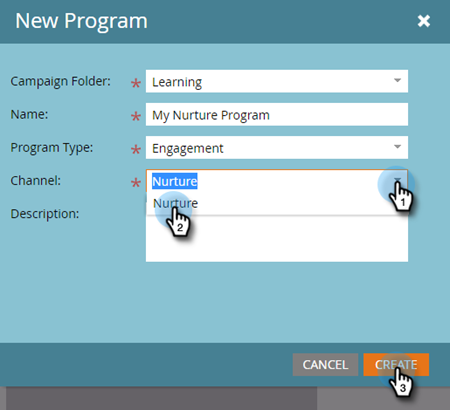

# 滴灌式培养 {#drip-drip-nurture}

## 使命：培养参加您最近贸易展的人 {#mission-nurture-the-people-who-attended-your-recent-tradeshow}

在Marketo中，您可以轻松创建高级而复杂的培养体系。 这是怎么做到的！

>[!PREREQUISITES]
>
>* [完成设置并添加人员](/help/marketo/getting-started/quick-wins/get-set-up-and-add-a-person.md){target="_blank"}
>* [导入人员列表](/help/marketo/getting-started/quick-wins/import-a-list-of-people.md){target="_blank"}

## 步骤1：创建参与计划 {#step-create-an-engagement-program}

1. 进入 **[!UICONTROL Marketing Activities]** 区域。

   

1. 选择&#x200B;**学习**&#x200B;文件夹，单击&#x200B;**[!UICONTROL New]**&#x200B;下拉菜单并选择&#x200B;**[!UICONTROL New Program]**。

   

1. 输入&#x200B;**[!UICONTROL Name]**&#x200B;并为&#x200B;**[!UICONTROL Engagement]**&#x200B;选择&#x200B;**[!UICONTROL Program Type]**。

   

1. 确保&#x200B;**[!UICONTROL Channel]**&#x200B;字段为&#x200B;**[!UICONTROL Nurture]**&#x200B;并单击&#x200B;**[!UICONTROL Create]**。

   

   您现在已经创建了一个参与计划。

## 步骤 2：创建电子邮件 {#step-create-an-email}

1. 选择您的参与计划，单击&#x200B;**[!UICONTROL New]**&#x200B;并选择&#x200B;**[!UICONTROL New Local Asset]**。

   

1. 单击 **[!UICONTROL Email]**。

   

1. 输入&#x200B;**[!UICONTROL Name]**，选择要使用的&#x200B;**[!UICONTROL Template]**，然后单击&#x200B;**[!UICONTROL Create]**。

   

   >[!NOTE]
   >
   >看不到电子邮件编辑器？ 您的浏览器可能阻止了窗口。 从浏览器中的`app.marketo.com`启用弹出窗口，然后单击顶部菜单栏中的&#x200B;**[!UICONTROL Edit Draft]**。

1. 输入主题。

   

1. 选择要编辑的电子邮件区域，单击齿轮图标并选择&#x200B;**[!UICONTROL Edit]**。

   

1. 编辑您的电子邮件并单击&#x200B;**[!UICONTROL Save]**。

   

1. 在&#x200B;**[!UICONTROL Email Actions]**&#x200B;下，单击&#x200B;**[!UICONTROL Approve and Close]**。

   

   >[!NOTE]
   >
   >请记住批准您的电子邮件，否则以后将无法激活它们。

1. 现在，通过重复步骤2-7中的操作创建另一封电子邮件。

   

## 步骤3：将内容添加到流 {#step-add-content-to-your-stream}

现在该使用您创建的电子邮件为您的参与计划创建内容流了。

1. 选择您的参与计划并单击&#x200B;**[!UICONTROL Streams]**&#x200B;选项卡。

   

1. 单击流中的&#x200B;**[!UICONTROL Add Content]**&#x200B;按钮。

   

   >[!TIP]
   >
   >您还可以使用&#x200B;**+**&#x200B;图标。

1. 保持选中“电子邮件”类型。 查找并选择您创建的两封电子邮件。

   

## 步骤4：激活流内容 {#step-activate-stream-content}

1. 通过单击流齿轮图标，然后单击&#x200B;**[!UICONTROL Activate all content]**&#x200B;来一次激活所有内容。

   

   >[!NOTE]
   >
   >如果不先批准内容，则无法激活该内容。

   做得好！ 再执行一步，参与计划已准备就绪。

## 步骤5：设置流节奏 {#step-set-the-stream-cadence}

1. 单击 **[!UICONTROL Set Stream Cadence]**。

   

1. 编辑设置以匹配所需的计划，然后单击&#x200B;**[!UICONTROL Save]**。

   

   您的参与计划已准备就绪。 现在，让我们向您的项目添加测试人员。

   >[!NOTE]
   >
   >测试人员负责检查您的参与计划，以在发送给客户之前测试其是否正确。

## 步骤6：将测试人员添加到参与计划 {#step-add-a-test-person-to-your-engagement-program}

1. 进入 **[!UICONTROL Database]** 区域。

   

1. 搜索您的测试人员。

   

   >[!NOTE]
   >
   >确保测试人员拥有有效的电子邮件地址，以便您可以在测试时确认电子邮件的接收。

1. 右键单击人员，然后单击&#x200B;**[!UICONTROL Programs]**&#x200B;和&#x200B;**[!UICONTROL Add to Engagement Program...]**。

   

1. 选择您的&#x200B;**[!UICONTROL Program]**&#x200B;和&#x200B;**[!UICONTROL Stream]**，然后单击&#x200B;**[!UICONTROL Run Now]**。

   

1. 任务完成！

1. 您应按指定的时间和节奏接收电子邮件。

   >[!NOTE]
   >
   >了解有关[参与计划](/help/marketo/product-docs/email-marketing/drip-nurturing/creating-an-engagement-program/understanding-engagement-programs.md){target="_blank"}的详细信息。

## 任务完成！ {#mission-complete}

  

[◄任务5：导入人员列表](/help/marketo/getting-started/quick-wins/import-a-list-of-people.md)

[任务7：个性化电子邮件►](/help/marketo/getting-started/quick-wins/personalize-an-email.md)
