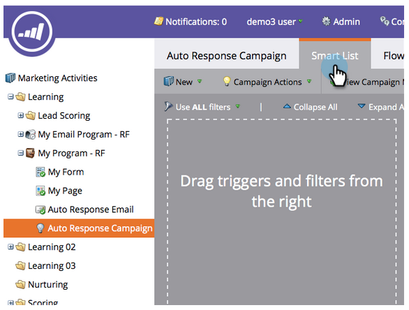
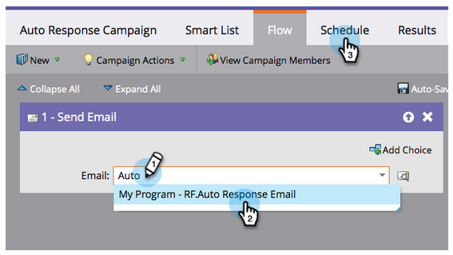

# 电子邮件自动响应 {#email-auto-response}

## 任务：当某人填写表单时，发送感谢电子邮件 {#mission-send-out-a-thank-you-email-when-a-person-fills-out-a-form}

>[!PREREQUISITES]
>
>* [设置并添加人员](/help/marketo/getting-started/quick-wins/get-set-up-and-add-a-person.md){target=&quot;_blank&quot;}
>* [包含表单的登陆页面](/help/marketo/getting-started/quick-wins/landing-page-with-a-form.md){target=&quot;_blank&quot;}

## 步骤1:创建电子邮件 {#step-create-an-email}

1. 转到“营销活动”区域。

   

1. 在左侧菜单中选择我的程序，单击新建下拉菜单，然后选择新建本地资产。

   

1. 单击“电子邮件”。

   

1. 将电子邮件命名为“自动响应电子邮件”，选择模板并单击“创建”。

   

   将在新窗口或选项卡中打开电子邮件编辑器。 如果弹出窗口被阻止，请单击 **编辑草稿** ，以访问电子邮件。

1. 输入主题行，然后双击电子邮件的可编辑区域。

   

   _将在电子邮件编辑器的顶部打开富文本编辑器。_

1. 突出显示现有电子邮件内容。

   

1. 键入您的电子邮件内容，然后单击保存。

   

1. 您的更改将自动保存。 关闭电子邮件编辑器选项卡/窗口。

   

1. 选择您的新电子邮件。 在“电子邮件操作”下，单击“批准”。

   

## 步骤2:创建智能营销活动 {#step-create-a-smart-campaign}

1. 右键单击 **我的程序** 单击 **新的智能营销活动**.

   

1. **名称** 您的智能营销活动“自动响应营销活动”，然后单击 **创建**.

   

1. 转到 **智能列表** 选项卡。

   

   我们将此营销活动设置为在用户填写您在中创建的表单时运行 [**包含表单的登陆页面**](/help/marketo/getting-started/quick-wins/landing-page-with-a-form.md){target=&quot;_blank&quot;}。

1. 查找并拖动 **填写表单** 触发到左画布。

   

1. 选择 **我的表单** 中。 单击 **流量** 选项卡。

   

1. 拖动 **发送电子邮件** “流”操作。

   

1. 选择 **自动响应电子邮件** 然后转到 **计划** 选项卡。

   

1. 单击 **编辑**.

   

1. 选择 **每次** 单击 **保存**.

   

1. 单击 **激活**.

   

1. 单击 **激活** 在确认屏幕上。

   

>[!NOTE]
>
>激活后，此营销活动将在用户每次填写指定表单时运行。 营销活动将一直运行，直到停用为止。

## 步骤3:填写表格 {#step-fill-out-the-form}

1. 选择 **我的页面**. 此操作是在 [包含表单的登陆页面](/help/marketo/getting-started/quick-wins/landing-page-with-a-form.md){target=&quot;_blank&quot;}快速获胜。

   

1. 单击 **“查看已批准”页面**.

   

   您的“免费试用版”登陆页面将在新选项卡中打开。

1. 在表单中填写名字、姓氏和电子邮件地址，然后单击 **提交**.

   

>[!NOTE]
>
>确保使用实际的电子邮件地址，以便收到电子邮件。

## 任务完成 {#mission-complete}

几分钟内，您应会在收件箱中看到自动响应电子邮件。 干得好！

  

[◄任务3:简单评分](/help/marketo/getting-started/quick-wins/simple-scoring.md)

[任务5:导入人员列表►](/help/marketo/getting-started/quick-wins/import-a-list-of-people.md)
