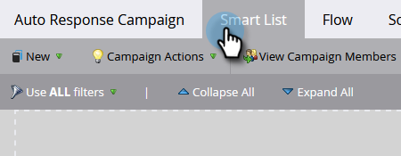

# 电子邮件自动响应 {#email-auto-response}

## 任务：在人员填写表单时发送感谢电子邮件 {#mission-send-out-a-thank-you-email-when-a-person-fills-out-a-form}

>[!PREREQUISITES]
>
>* [设置并添加人员](/help/marketo/getting-started/quick-wins/get-set-up-and-add-a-person.md){target="_blank"}
>* 带有表单的[登陆页面](/help/marketo/getting-started/quick-wins/landing-page-with-a-form.md){target="_blank"}

## 步骤1：创建电子邮件 {#step-create-an-email}

1. 转到&#x200B;**[!UICONTROL 营销活动]**&#x200B;区域。

   

1. 在左侧菜单中选择您的程序，单击&#x200B;**[!UICONTROL 新建]**&#x200B;下拉列表，然后选择&#x200B;**[!UICONTROL 新建本地资产]**。

   

1. 选择&#x200B;**[!UICONTROL 电子邮件]**。

   

1. 将您的电子邮件命名为“自动响应电子邮件”，选择一个模板，然后单击&#x200B;**[!UICONTROL 创建]**。

   

   将在新窗口或选项卡中打开电子邮件编辑器。 如果阻止弹出窗口，请单击资产摘要页面上的&#x200B;**[!UICONTROL 编辑草稿]**&#x200B;以访问电子邮件。

1. 输入主题行，然后双击电子邮件的可编辑区域。

   

   _富文本编辑器将在电子邮件编辑器的顶部打开。_

1. 突出显示现有电子邮件内容。

   

1. 键入您的电子邮件内容，然后单击&#x200B;**[!UICONTROL 保存]**。

   

1. 单击&#x200B;**[!UICONTROL 电子邮件操作]**&#x200B;下拉列表，然后选择&#x200B;**[!UICONTROL 批准并关闭]**。

   

## 步骤2：创建Smart Campaign {#step-create-a-smart-campaign}

1. 选择您的项目，单击&#x200B;**[!UICONTROL 新建]**&#x200B;下拉列表，然后选择&#x200B;**[!UICONTROL 新建Smart Campaign]**。

   

1. **将您的智能营销活动命名为**&#x200B;自动响应营销活动，然后单击&#x200B;**[!UICONTROL 创建]**。

   

1. 转到&#x200B;**[!UICONTROL 智能列表]**&#x200B;选项卡。

   

   我们将设置此营销活动，每当有人使用表单&#x200B;**[&#128279;](/help/marketo/getting-started/quick-wins/landing-page-with-a-form.md){target="_blank"}填写您在**&#x200B;登陆页面中创建的表单时运行。

1. 查找&#x200B;**[!UICONTROL 填写表单]**&#x200B;触发器并将其拖到画布上。

   

1. 在下拉列表中选择&#x200B;**[!UICONTROL 我的表单]**。 然后单击&#x200B;**[!UICONTROL 流]**&#x200B;选项卡。

   

1. 将&#x200B;**[!UICONTROL 发送电子邮件]**&#x200B;流程操作拖到左画布上。

   

1. 选择您的&#x200B;**自动响应电子邮件**。 然后单击&#x200B;**[!UICONTROL 计划]**&#x200B;选项卡。

   

1. 单击&#x200B;**[!UICONTROL 编辑]**。

   

1. 每次选择&#x200B;**&#x200B;**&#x200B;并单击&#x200B;**[!UICONTROL 保存]**。

   

1. 单击&#x200B;**[!UICONTROL 激活]**。

   

1. 在确认屏幕上单击&#x200B;**[!UICONTROL 激活]**。

   

>[!NOTE]
>
>一旦激活，此营销活动将在每次人员填写指定表单时运行。 该营销活动将继续运行，直到被停用。

## 第3步：填写表单 {#step-fill-out-the-form}

1. 选择&#x200B;**我的页面**（该页面是在具有表单[&#128279;](/help/marketo/getting-started/quick-wins/landing-page-with-a-form.md){target="_blank"}快速入选的登陆页面中创建的），然后单击&#x200B;**[!UICONTROL 预览]**。

   

   _您的“免费试用”登陆页面将在新选项卡中打开。_

1. 填写您的名字、姓氏和电子邮件地址，然后单击&#x200B;**[!UICONTROL 提交]**。

   

>[!NOTE]
>
>确保使用实际的电子邮件地址，以便获取电子邮件。

## 任务完成 {#mission-complete}

在几分钟内，您应会在收件箱中看到自动响应电子邮件。 做得好！

  

[◄任务3：简单评分](/help/marketo/getting-started/quick-wins/simple-scoring.md)

[任务5：导入人员列表►](/help/marketo/getting-started/quick-wins/import-a-list-of-people.md)
