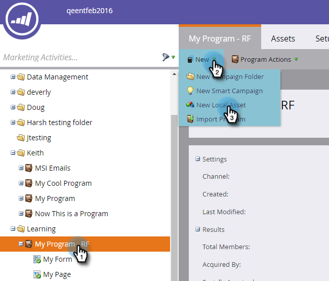

# 电子邮件自动响应 {#email-auto-response}

## 任务：在用户填写表单时发送感谢电子邮件 {#mission-send-out-a-thank-you-email-when-a-person-fills-out-a-form}

>[!NOTE]
>
>**FYI**
>
>Marketo现在正在所有订阅实现语言标准化，因此您可能会在订阅和docs.marketo.com中看到潜在客户／潜在客户。 这些术语的含义是相同的；它不影响文章说明。 还有一些其他变化。 [了解更多](http://docs.marketo.com/display/DOCS/Updates+to+Marketo+Terminology)。

>[!NOTE]
>
>**先决条件**
>
>* [设置并添加人物](get-set-up-and-add-a-person.md)
>* [登陆页表单](landing-page-with-a-form.md)

>

## 第1步：创建电子邮件 {#step-create-an-email}

1. 转到“营销活动”区域。

   

1. 选择左侧菜单中的“我的项目”，单击“新建”下拉框，然后选择“新建本地资产”。

   

1. 单击“电子邮件”。

   

1. 将电子邮件命名为“自动响应电子邮件”，选择模板，然后单击创建。

   

   将在新窗口或选项卡中打开电子邮件编辑器。 如果弹出窗口被阻止，请单击资产摘要页面上的“编辑草稿”**，以访问电子邮件。

1. 输入主题行，然后多次单击电子邮件的可编辑区域。

   

   将在电子邮件编辑器顶部打开富文本编辑器。

1. 突出显示现有电子邮件内容。

   

1. 键入您的电子邮件内容，然后单击“保存”。

   

1. 您所做的更改将自动保存。 关闭电子邮件编辑器选项卡／窗口。

   

1. 选择新电子邮件。 在“电子邮件操作”下，单击“批准”。

   

## 第2步：创建智能活动 {#step-create-a-smart-campaign}

1. 右键单击“ **我的项目** ”，然 **后单击“新建智能活动**”。

   

1. **将智能活动** 命名为“自动响应活动”，然后单击“创 **建”**。

   

1. 转到**智能列表**选项卡。

   

   我们将设置此活动，以便用户在用表单填写您在登陆页中创建 [**的表单时运行**](landing-page-with-a-form.md)。

1. 查找并将“填 **充表单”触发** 器拖动到左侧画布。

   

1. 在下 **拉框中** ，选择“我的表单”。 单击**流**选项卡。

   

1. 将**“发送电子邮件”**“流”操作拖至左侧画布。

   

1. 选择 **自动回复** “电子邮件”并转至**计划**选项卡。

   

1. 单击 **编辑**。

   
每次选择，然后单击“保存”。
   

1. 单击 **激活**。

   

1. 单击确认屏幕上的**激活**。

   

>[!NOTE]
>
>激活后，此活动将在用户每次填写指定表单时运行。 活动将一直运行，直到停用。

## 第3步：填写表单 {#step-fill-out-the-form}

1. 选择 **我的页面**。 这是在登陆页 [中通过快速赢取表单](landing-page-with-a-form.md) 创建的。

   

1. 单击 **视图批准页面**。

   

   您的“免费试用”登陆页将在新选项卡中打开。

1. 用您的名字、姓氏和电子邮件地址填写表单，然后单击“提 **交”**。

   

>[!NOTE]
>
>确保使用实际的电子邮件地址，以便获得电子邮件。

## 任务完成 {#mission-complete}

在几分钟内，您会在收件箱中看到自动响应电子邮件。 干得好！

  

[◄任务3:简单评分](simple-scoring.md)[任务5:导入列表Lead](import-a-list-of-people.md)