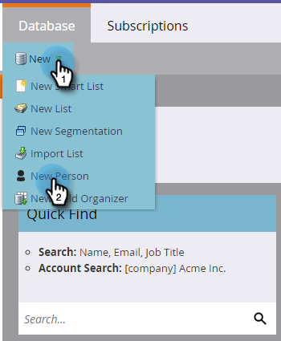

# 设置并添加人员 {#get-set-up-and-add-a-person}

在开始任务之前，有些事要做。

## 步骤1:登录Marketo {#step-log-in-to-marketo}

1. [登录Marketo](https://app.marketo.com) 使用您通过电子邮件收到的凭据。

   

## 步骤2:创建学习文件夹 {#step-create-a-learning-folder}

我们创建一个文件夹，存放任务中要做的所有内容。

1. 转到 **营销活动** 的上界。

   

1. 单击 **新建** 下拉框并选择 **新建Campaign文件夹**.

   

1. 将文件夹命名为“Learning”，然后单击 **创建**.

   

1. 左侧菜单中将显示新的“学习”文件夹。

   

## 步骤3:将您自己添加为人员 {#step-add-yourself-as-a-person}

在Marketo中将您自己添加为人员，以便以后能够向自己发送测试电子邮件。

1. 转到 **数据库** 的上界。

   

1. 单击 **新建** 下拉框并选择 **新人**.

   

1. 键入您的名字和姓氏、电子邮件地址和公司名称，然后单击 **创建** 将自己添加为人。

   

   >[!CAUTION]
   >
   >Marketo **not** 支持包含表情符号的电子邮件地址。

1. 要查看您的人员，请在左侧菜单中打开系统智能列表，然后单击“所有人员”。

   

1. 单击 **人员** 选项卡。 你应该在数据库中看到自己。

   

## 设置完成 {#set-up-complete}

你准备好开始你的第一个任务了！

  

[任务1:发送电子邮件爆炸►](/help/marketo/getting-started/quick-wins/send-an-email.md)
