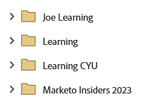

# 完成设置并添加人员 {#get-set-up-and-add-a-person}

在开始任务之前，您需要先完成以下几步操作。

## 步骤 1：登录 Marketo Engage {#step-log-in-to-marketo}

1. 使用您通过电子邮件收到的凭据[登录 Marketo Engage](https://app.marketo.com){target="_blank"}。

   

## 步骤 2：创建学习文件夹 {#step-create-a-learning-folder}

让我们创建一个文件夹，用于存放您在任务中创建的所有内容。

1. 进入 **[!UICONTROL Marketing Activities]** 区域。

   

1. 点击 **[!UICONTROL New]** 下拉菜单，并选择 **[!UICONTROL New Campaign Folder]**。

   

1. 将文件夹命名为“学习”，然后单击 **[!UICONTROL Create]**。

   

1. 您将在左侧菜单中看到新建的“学习”文件夹。

   

## 步骤 3：将自己添加为人员 {#step-add-yourself-as-a-person}

在 Marketo 中将自己添加为人员，以便后续可以向自己发送测试电子邮件。

1. 进入 **[!UICONTROL Database]** 区域。

   

1. 点击 **[!UICONTROL New]** 下拉菜单，并选择 **[!UICONTROL New Person]**。

   

1. 输入您的名字和姓氏、电子邮件地址以及公司名称，然后单击 **[!UICONTROL Create]** 将自己添加为人员。

   

   >[!CAUTION]
   >
   >* 请确保电子邮件地址仅包含 ASCII 字符。
   >
   >* Marketo **不**&#x200B;支持包含表情符号的电子邮件地址。

1. 要查看您的人员，请在左侧菜单中打开 [!UICONTROL System Smart Lists] ，然后点击 **[!UICONTROL All People]**。

   

1. 单击 **[!UICONTROL People]** 选项卡。您应能在数据库中看到自己。

   

## 设置完成 {#set-up-complete}

您已准备好开始您的第一个任务！

  

[任务 1：群发电子邮件 ►](/help/marketo/getting-started/quick-wins/send-an-email.md)
