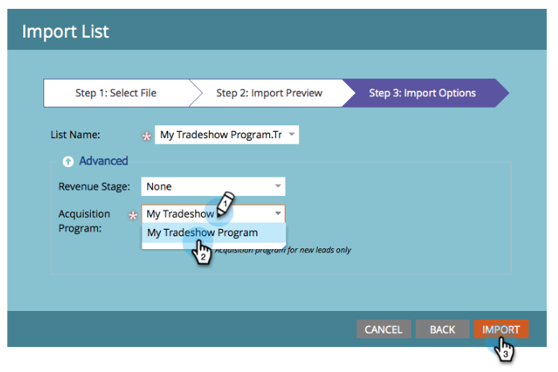

# 导入人员{#import-a-list-of-people}列表

## 任务：将trade show与会者的电子表格列表导入数据库{#mission-import-a-spreadsheet-list-of-trade-show-attendees-into-your-database}

>[!PREREQUISITES]
>
>[设置并添加人](/help/marketo/getting-started/quick-wins/get-set-up-and-add-a-person.md)

在本教程中，您将学习如何将人员从电子表格文件导入Marketo。

## 第1步：下载并编辑电子表格{#step-download-and-edit-a-spreadsheet}

1. 要进行开始，请将我们的实践电子表格文件([**tradeshow-reathes.csv**](https://docs.marketo.com/display/docs/assets/tradeshow-attendees.csv))下载到您的计算机。

   

   >[!NOTE]
   >
   >导入日期时，请使用以下格式：**9/21/20**（月/日/年）。

   >[!NOTE]
   >
   >导入的任何日期/时间字段均视为中心时间。 如果您在其他时区中有日期/时间字段，则可以使用Excel公式将其转换为中时（美国/芝加哥）。

1. 添加您自己的名字、姓氏、电子邮件地址和职位，然后将文件保存到您的计算机上。

   

>[!NOTE]
>
>在CSV文件中输入您的真实电子邮件地址，这样您就可以接收在下一次任务中发送的有意义的电子邮件。

## 第2步：创建项目{#step-create-a-program}

1. 转至&#x200B;**营销活动**&#x200B;区域。

   

1. 选择&#x200B;**Learning**&#x200B;文件夹，然后在&#x200B;**New**&#x200B;下单击&#x200B;**New 项目**。

   

1. **将** 项目命名为“我的贸易展项目”，然后为“项目类型”选择“ **事件”**。

   

1. 为&#x200B;**渠道**&#x200B;选择&#x200B;**Tradeshow**，然后单击&#x200B;**创建**。

   

>[!NOTE]
>
>事件项目在特定日期发生。 了解有关&#x200B;[**事件**](/help/marketo/product-docs/demand-generation/events/understanding-events/understanding-event-programs.md)&#x200B;的更多信息。

## 第3步：将电子表格导入Marketo {#step-import-your-spreadsheet-into-marketo}

1. 在&#x200B;**我的贸易展项目**&#x200B;中，单击&#x200B;**新建**&#x200B;并选择&#x200B;**新建本地资产**。

   

1. 单击&#x200B;**列表**。

   

1. **将列表** 命名为“贸易展与会者”，然后单击“ **创建**”。

   

1. 在您的&#x200B;**展会与会者**&#x200B;列表中，单击&#x200B;**列表操作**&#x200B;并选择&#x200B;**导入列表**。

   

   >[!CAUTION]
   >
   >如果您使用自己的CSV文件，请确保它是编码为UTF-8、UTF-16、Shift-JIS或EUC-JP。

   >[!NOTE]
   >
   >CSV文件的大小限制为100MB。

1. **浏** 览到您 **计算机上的tradeshow-** hootes.csvspreadsheet文件，然后单击“ **下一步**”。

   

   >[!NOTE]
   >
   >在“列表导入模式”中，选择&#x200B;**跳过新人和更新**&#x200B;意味着您不会影响现有人员记录或记录任何活动。 如果您希望对现有人员进行快速、预过滤的静态列表，以便在营销活动中使用，请使用此模式。 选择此模式将：
   >
   > * 跳过新人的创建
   > * 跳过人员字段更新
   > * 跳过活动记录

1. 将您的列表列字段映射到各自的Marketo字段，然后单击&#x200B;**下一步**。

   

   >[!TIP]
   >
   >列标题应始终与字段完全匹配（区分大小写），以获得最佳的自动映射结果。 如果您使用的是自定义字段，但在下拉列表中未看到这些字段，请返回并[创建它们](/help/marketo/product-docs/administration/field-management/create-a-custom-field-in-marketo.md)，以便它们成为选项。

   >[!NOTE]
   >
   >如果有任何不想导入的字段，请在“Marketo字段”下拉菜单中选择&#x200B;**忽略**。

1. 为&#x200B;**客户获取项目**&#x200B;选择&#x200B;**我的贸易展项目**，然后单击&#x200B;**导入**。

   

1. 等待您的人员导入，然后关闭导入进度弹出窗口。

   

1. 返回至&#x200B;**“我的贸易展项目**”，单击&#x200B;**成员**&#x200B;选项卡。 您会看到所有刚刚导入的人。

   

>[!NOTE]
>
>您可以通过跟踪项目成员身份来分析项目的成功。 了解有关&#x200B;[**项目**](/help/marketo/product-docs/core-marketo-concepts/programs/creating-programs/understanding-programs.md)&#x200B;的更多信息。

## 任务完成{#mission-complete}

您的贸易展与会者现在是您的Marketo项目的成员！

  

[◄任务4:电子邮件自动响应](/help/marketo/getting-started/quick-wins/email-auto-response.md)

[任务6:滴，滴，培养►](/help/marketo/getting-started/quick-wins/drip-drip-nurture.md)
