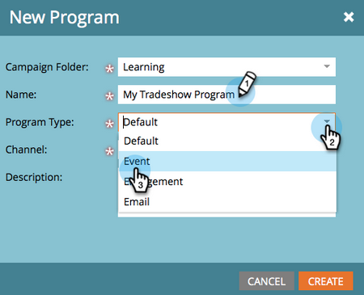

# 导入人员列表 {#import-a-list-of-people}

## 任务：将贸易展会与会者的电子表格列表导入数据库 {#mission-import-a-spreadsheet-list-of-trade-show-attendees-into-your-database}

>[!PREREQUISITES]
>
>[设置并添加人员](/help/marketo/getting-started/quick-wins/get-set-up-and-add-a-person.md){target="_blank"}

在本教程中，您将了解如何将人员从电子表格文件导入Marketo。

## 步骤1：下载并编辑电子表格 {#step-download-and-edit-a-spreadsheet}

1. 要开始，请下载我们的实践电子表格文件([**tradeshow-attendees.csv**](/help/marketo/getting-started/assets/tradeshow-attendees.csv){target="_blank"})到您的计算机。

   

   >[!NOTE]
   >
   >导入日期时，请使用此格式： **9/21/20** （月/日/年）。

   >[!NOTE]
   >
   >正在导入的任何日期/时间字段都将被视为中部时间。 如果您的日期/时间字段位于不同的时区，则可以使用Excel公式将其转换为中部时间（美洲/芝加哥）。

1. 添加您自己的名字、姓氏、实际电子邮件地址（这样您就可以接收将在下一个任务中发送的培养型电子邮件）以及职务。 将文件保存在计算机上。

   

   >[!CAUTION]
   >
   >Marketo会 **非** 支持包含表情符号的电子邮件地址。

## 第2步：创建项目 {#step-create-a-program}

1. 转到 **[!UICONTROL 营销活动]** 区域。

   

1. 选择您的 **学习** 文件夹，然后在 **[!UICONTROL 新建]** 单击 **[!UICONTROL 新建项目群]**.

   

1. **名称** “我的贸易展计划”并选择“事件”作为 **[!UICONTROL 项目类型]**.

   

1. 选择 **[!UICONTROL 商展]** 对于 **[!UICONTROL 渠道]** 并单击 **[!UICONTROL 创建]**.

   

>[!NOTE]
>
>事件程序在特定日期发生。 了解有关 [**活动**](/help/marketo/product-docs/demand-generation/events/understanding-events/understanding-event-programs.md){target="_blank"}.

## 步骤3：将电子表格导入Marketo {#step-import-your-spreadsheet-into-marketo}

1. 在 **我的贸易展览计划**，单击 **[!UICONTROL 新建]** 并选择 **[!UICONTROL 新建本地资产]**.

   

1. 选择 **[!UICONTROL 列表]**.

   

1. **名称** “贸易展览与会者”列表并单击 **[!UICONTROL 创建]**.

   

1. 在您的 **[!UICONTROL 贸易展览与会者]** 列表，单击 **[!UICONTROL 列出操作]** 并选择 **[!UICONTROL 导入列表]**.

   

   >[!CAUTION]
   >
   >如果您使用自己的CSV文件，请确保该文件采用UTF-8、UTF-16、Shift-JIS或EUC-JP编码。

   >[!NOTE]
   >
   >CSV文件的大小限制为100MB。

1. **[!UICONTROL 浏览]** 到 **tradeshow-attendees.csv** 电子表格文件，然后单击 **[!UICONTROL 下一个]**.

   

   >[!NOTE]
   >
   >在列表导入模式下，选择 **[!UICONTROL 跳过新人员和更新]** 意味着您不会影响现有人员记录或记录任何活动。 如果您希望在营销活动中使用的现有人员的快速、预过滤静态列表，请使用此模式。 选择此模式将：
   >
   > * 跳过新人员创建
   > * 跳过人员字段更新
   > * 跳过活动日志记录

1. 映射您的 [!UICONTROL 列表列] 字段到它们各自的Marketo字段并单击 **[!UICONTROL 下一个]**.

   

   >[!TIP]
   >
   >列标题应始终与字段完全匹配（区分大小写），以获得最佳自动映射结果。 如果您使用的是自定义字段，但在下拉列表中看不到它们，请返回并 [创建它们](/help/marketo/product-docs/administration/field-management/create-a-custom-field-in-marketo.md){target="_blank"} 这样它们就可以变成选项。

   >[!NOTE]
   >
   >如果有任何您不想导入的字段，请选择 **忽略** “Marketo字段”下拉菜单中。

1. 选择 **我的贸易展览计划** 对于 **[!UICONTROL 客户获取计划]**，然后单击 **[!UICONTROL 导入]**.

   

1. 等待人员导入，然后关闭导入进度弹出窗口。

   

1. 返回 **我的贸易展览计划**，单击 **[!UICONTROL 成员]** 选项卡。 您将看到所有您刚刚导入的人员。

   

>[!NOTE]
>
>您可以通过跟踪计划会员资格来分析计划是否成功。 了解有关 [**程序**](/help/marketo/product-docs/core-marketo-concepts/programs/creating-programs/understanding-programs.md){target="_blank"}.

## 任务完成 {#mission-complete}

您的商展与会者现在已成为Marketo计划的成员！

  

[◄任务4：电子邮件自动响应](/help/marketo/getting-started/quick-wins/email-auto-response.md)

[任务6：滴水、滴水、Nurture ►](/help/marketo/getting-started/quick-wins/drip-drip-nurture.md)
