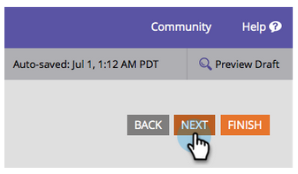
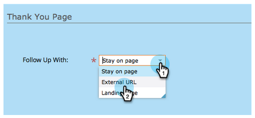
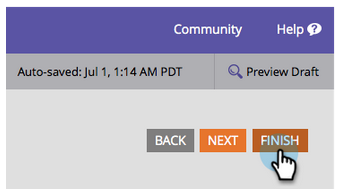
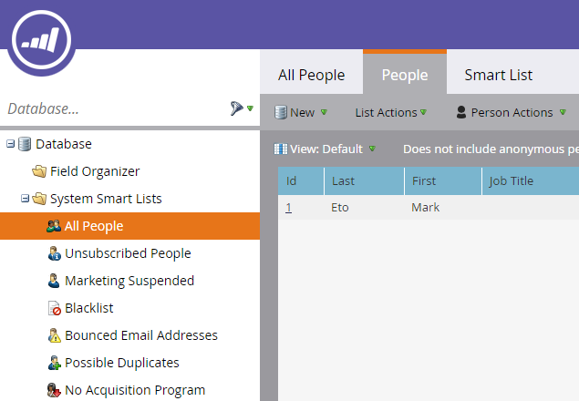

# 登陆页{#landing-page-with-a-form}

## 任务：使用表单创建登陆页以赢取新人。{#mission-create-a-landing-page-with-a-form-to-acquire-new-people}

>[!PREREQUISITES]
>
>[设置并添加人](/help/marketo/getting-started/quick-wins/get-set-up-and-add-a-person.md)

## 第1步：创建项目{#step-create-a-program}

1. 转至&#x200B;**营销活动**&#x200B;区域。

   

1. 选择在[上一个快速Win](/help/marketo/getting-started/quick-wins/send-an-email.md)中创建的&#x200B;**Learning**&#x200B;文件夹。

   

1. 在&#x200B;**新建**&#x200B;下，单击&#x200B;**新建项目**。

   

1. 输入项目&#x200B;**名称**，选择&#x200B;**渠道**，然后单击&#x200B;**创建**。

   >[!NOTE]
   >
   >在项目名称的末尾包含您的姓名首字母，使其唯一。

   

   >[!NOTE]
   >
   >项目是一个特定的营销计划。 **渠道**&#x200B;旨在成为投放机制，如网络研讨会、赞助或在线广告。 您可能会在下拉列表中看到不同的渠道选项，具体取决于您自己的实例中提供的内容。 您还可以[创建您自己的渠道](/help/marketo/product-docs/administration/tags/create-a-program-channel.md)。

   

干得好！ 既然我们已经创建了项目，让我们继续并创建一些内容。

## 第2步：创建表单{#step-create-a-form}

1. 选择您的项目后，单击&#x200B;**新建**，然后单击&#x200B;**新建本地资产**。

   

1. 选择&#x200B;**表单**。

   

1. 输入表单&#x200B;**名称**，然后单击&#x200B;**创建**。

   

   >[!NOTE]
   >
   >确保选中&#x200B;**在编辑器中打开**&#x200B;框。 否则，您需要单击&#x200B;**编辑表单**&#x200B;选项卡。

   >[!TIP]
   >
   >看不到表单编辑器？ 您的浏览器可能已阻止该窗口。 在您的浏览器中启用[app.marketo.com](https://app.marketo.com/)中的弹出窗口，然后单击顶部菜单栏中的“编辑草稿”。

1. 选择&#x200B;**电子邮件地址**&#x200B;字段，然后检查&#x200B;**必填**。

   

1. 单击&#x200B;**下一步**。

   

1. 单击箭头可滚动浏览主题。 选择一个。

   

1. 单击&#x200B;**下一步**。

   

1. 在感谢页面部分下，为&#x200B;**跟进**&#x200B;选择&#x200B;**外部URL**。

   

1. 输入URL。

   

   >[!NOTE]
   >
   >“随访”页面是填写表单后访客重新定向的位置。 外部URL是一个选项，但有其他选项。 请参阅[设置表单感谢页面](/help/marketo/product-docs/demand-generation/forms/creating-a-form/set-a-form-thank-you-page.md)。

1. 单击&#x200B;**完成**。

   

1. 单击&#x200B;**批准并关闭**。

   

   超级！ 现在您有了包含表单的项目。 让我们继续创建页面。

   

## 第3步：创建登陆页并添加表单{#step-create-a-landing-page-and-add-your-form}

1. 选择您的项目后，单击&#x200B;**新建**，然后单击&#x200B;**新建本地资产**。

   

1. 选择&#x200B;**登陆页**。

   

1. 输入页面&#x200B;**名称**，选择模板并单击&#x200B;**创建**。

   >[!NOTE]
   >
   >您可能有一个与我们屏幕截图中不同的模板，没关系，只需选择一个模板，然后继续操作。

   

1. 打开登陆页编辑器后，将“表单”元素拖入画布。

   

1. 查找并选择表单，然后单击&#x200B;**插入**。

   

1. 将表单拖动到所需位置。

   

1. 您的所有更改都将自动保存。 关闭表单编辑器选项卡/窗口。

   

   干得好！ 您现在有一个登陆页，上面有表单。 让我们批准您的页面，使其生效。

## 第4步：批准您的登陆页{#step-approve-your-landing-page}

1. 选择您的登陆页，在&#x200B;**登陆页操作**&#x200B;下单击&#x200B;**批准**。

   >[!NOTE]
   >
   >批准登陆页将使其可在Internet上直播和访问。

   

   完美！ 看到上面的绿色复选标记吗？

   

## 第5步：测试表单{#step-test-your-form}

1. 选择您的登陆页，然后单击&#x200B;**视图批准页面**。

   

1. 使用您知道的唯一信息填写表单，然后单击&#x200B;**提交**。

   

1. 转到&#x200B;**Database**&#x200B;区域。

   

1. 搜索在填写表单时使用的唯一电子邮件地址。

   

   就在这里！ 您创建了一个带有表单的新登陆页，并使用它生成新人。

   

## 任务完成！{#mission-complete}

  

[◄发送电子邮件爆炸](/help/marketo/getting-started/quick-wins/send-an-email.md)

[简单评分►](/help/marketo/getting-started/quick-wins/simple-scoring.md)
