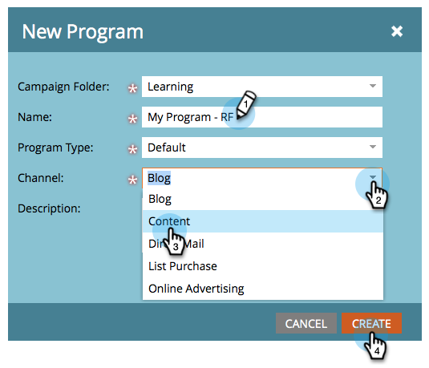

# 带有表单的登陆页面 {#landing-page-with-a-form}

## 任务：创建一个带有表单的登陆页面，以吸引新人员。 {#mission-create-a-landing-page-with-a-form-to-acquire-new-people}

>[!PREREQUISITES]
>
>[设置并添加人员](/help/marketo/getting-started/quick-wins/get-set-up-and-add-a-person.md)

## 第1步：创建程序 {#step-create-a-program}

1. 转到 **[!UICONTROL 营销活动]** 区域。

   

1. 选择 **学习** 文件夹创建于 [上一个快速入选](/help/marketo/getting-started/quick-wins/send-an-email.md){target="_blank"}. 下 **[!UICONTROL 新建]**，单击 **[!UICONTROL 新建项目群]**.

   

1. 输入项目群 **[!UICONTROL 名称]**，选择一个 **[!UICONTROL 渠道]**，然后单击 **[!UICONTROL 创建]**.

   

   >[!TIP]
   >
   >在项目名称的末尾包含您的缩写以使其唯一。

   >[!NOTE]
   >
   >项目是一项特定的营销计划。 此 **渠道** 旨在作为投放机制，如网络研讨会、赞助或在线广告。 根据您自己的实例中提供的内容，您可能会在下拉列表中看到不同的渠道选项。 您还可以 [创建您自己的渠道](/help/marketo/product-docs/administration/tags/create-a-program-channel.md){target="_blank"}.

做得好！ 现在，我们已经创建了一个项目，接下来让我们创建一些内容。

## 第2步：创建表单 {#step-create-a-form}

1. 选择项目后，单击 **[!UICONTROL 新建]** 下拉并选择 **[!UICONTROL 新建本地资产]**.

   

1. 选择 **[!UICONTROL 表单]**.

   

1. 输入表单 **[!UICONTROL 名称]** 并单击 **[!UICONTROL 创建]**.

   

   >[!NOTE]
   >
   >确保 **[!UICONTROL 在编辑器中打开]** 复选框。 如果不是，则需要单击 **[!UICONTROL 编辑表单]** 选项卡。

   >[!TIP]
   >
   >看不到表单编辑器？ 您的浏览器可能阻止了窗口。 启用弹出窗口 `app.marketo.com` ，然后单击顶部菜单栏中的编辑草稿。

1. 选择 **[!UICONTROL 电子邮件地址]** 字段和检查 **[!UICONTROL 为必填项]**.

   

1. 单击 **[!UICONTROL 下一个]**.

   

1. 单击箭头可滚动浏览主题。 选择一个。

   

1. 单击 **[!UICONTROL 下一个]**.

   

1. 在感谢页面部分下，选择 **[!UICONTROL 外部URL]** 对象 **[!UICONTROL 跟进]**.

   

1. 输入URL。

   

   >[!NOTE]
   >
   >“跟进”页面是在填写表单后重定向访客的位置。 外部URL是一个选项，但还有更多选项。 请参阅 [设置表单感谢页面](/help/marketo/product-docs/demand-generation/forms/creating-a-form/set-a-form-thank-you-page.md){target="_blank"}.

1. 单击 **[!UICONTROL 完成]**.

   

1. 单击 **[!UICONTROL 批准并关闭]**.

   

   太棒了！ 现在，您有一个包含表单的程序。 让我们继续并创建页面。

## 第3步：创建登陆页面并添加表单 {#step-create-a-landing-page-and-add-your-form}

1. 选择项目后，单击 **[!UICONTROL 新建]** 下拉并选择 **[!UICONTROL 新建本地资产]**.

   

1. 选择 **[!UICONTROL 登陆页面]**.

   

1. 输入页面 **[!UICONTROL 名称]**，选择模板并单击 **[!UICONTROL 创建]**.

   >[!NOTE]
   >
   >您可能有不同的模板，不同于屏幕快照中的模板，没关系，只要选择一个模板并继续操作即可。

   

1. 打开登陆页面编辑器后，拖动 [!UICONTROL 表单] 元素出现在画布上。

   

1. 查找并选择您的表单，然后单击 **[!UICONTROL 插入]**.

   

1. 将表单拖动到所需的位置。

   

1. 所有更改都将自动保存。 关闭表单编辑器选项卡/窗口。

   

   做得好！现在，您有一个登陆页面，上面有一个表单。 让我们批准您的页面以使其上线。

## 第4步：批准您的登陆页面 {#step-approve-your-landing-page}

1. 选择您的登陆页面，然后单击 **[!UICONTROL 批准草稿]**.

   

   >[!NOTE]
   >
   >批准登陆页面后，即可使其上线并可在Internet上访问。

   完美！ 看到上面绿色的复选标记了吗？

   

## 步骤5：测试表单 {#step-test-your-form}

1. 选择您的登陆页面，然后单击 **[!UICONTROL 查看已批准的页面]**.

   

1. 在表单中填写您知道独特的信息，然后单击 **[!UICONTROL 提交]**.

   

1. 转到 **[!UICONTROL 数据库]** 区域。

   

1. 搜索您在填写表单时使用的唯一电子邮件地址。

   

   就在这儿！ 您创建了一个带有表单的新登陆页面，并使用它生成了一个新人员。

   

## 任务完成！ {#mission-complete}

  

[◄任务1：发送电子邮件爆炸邮件](/help/marketo/getting-started/quick-wins/send-an-email.md)

[任务3：简单评分►](/help/marketo/getting-started/quick-wins/simple-scoring.md)
