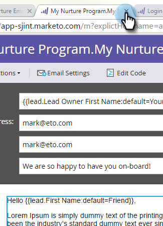

# 个性化电子邮件{#personalize-an-email}

## 任务：通过添加数据令牌{#mission-make-your-emails-personal-by-adding-data-tokens}使您的电子邮件个性化

>[!PREREQUISITES]
>
>* [设置并添加人](/help/marketo/getting-started/quick-wins/get-set-up-and-add-a-person.md)
>* [发送电子邮件爆炸](/help/marketo/getting-started/quick-wins/send-an-email.md)
>* [滴，滴，培养](/help/marketo/getting-started/quick-wins/drip-drip-nurture.md)

## 第1步：选择要个性化{#step-select-an-email-to-personalize}的电子邮件

1. 选择在[上一个快速Win](/help/marketo/getting-started/quick-wins/drip-drip-nurture.md)中创建的培养电子邮件之一，然后单击&#x200B;**编辑草稿**。

   

   >[!NOTE]
   >
   >这会创建电子邮件的草稿副本。 您必须批准草稿，更改才能生效。

如果尚未启用弹出窗口阻止程序，则电子邮件编辑器将在新选项卡/窗口中打开。 否则，单击&#x200B;**编辑草稿**&#x200B;两次。

## 第2步：将销售人员设为发件人{#step-make-the-salesperson-the-sender}

1. 选择&#x200B;**From**&#x200B;字段，突出显示并删除&#x200B;**当前名称。**

   

1. 单击&#x200B;**“发件人”字段右侧的**&#x200B;令牌&#x200B;**图标。**

   

1. 查找并选择&#x200B;**`{{lead.Lead Owner First Name}}`**&#x200B;令牌。

   

1. 键入您的公司名和&#x200B;**默认值**&#x200B;的短划线，以确保在销售代表的名字不可用时显示某些内容。 单击&#x200B;**插入**。

   

1. 点击&#x200B;**From**&#x200B;字段中的空格栏，确保光标在刚刚插入的标记后闪烁一个空格。 然后再次单击&#x200B;**令牌**&#x200B;图标。

   

1. 查找并选择&#x200B;**`{{lead.Lead Owner Last Name}}`**&#x200B;令牌。

   

1. 键入&#x200B;**默认值**&#x200B;的“销售”，然后单击&#x200B;**插入**。

   

## 第3步：将潜在客户姓名添加到电子邮件{#step-add-the-leads-name-to-the-email}

1. 选择顶部的可编辑部分，单击齿轮图标，然后选择&#x200B;**编辑**。

   

1. 在“Hello”后添加一个空格，将光标放在逗号前面，然后单击&#x200B;**插入令牌**&#x200B;图标。

   

1. 查找并选择&#x200B;**`{{lead.First Name}}`**&#x200B;令牌。

   

1. 在&#x200B;**默认值**&#x200B;字段中输入“Friend”（或您想要的任何标签），然后单击&#x200B;**插入**。

   

   >[!TIP]
   >
   >始终包含令牌的默认值；这可确保在缺少部分个人信息时，电子邮件中将显示默认值。

1. 单击&#x200B;**保存**。

   

1. 关闭电子邮件编辑器选项卡/窗口。

   

1. 在&#x200B;**电子邮件操作**&#x200B;下，选择&#x200B;**批准草稿**。

   

>[!TIP]
>
>需要快速复习一下如何给自己发送电子邮件？ 请参阅[发送电子邮件爆炸](/help/marketo/getting-started/quick-wins/send-an-email.md)。

### 任务完成{#mission-complete}

祝贺您，您的电子邮件已个性化！

  

[◄任务6:滴，滴，培养](/help/marketo/getting-started/quick-wins/drip-drip-nurture.md)

[任务8:提醒销售代表►](/help/marketo/getting-started/quick-wins/alert-the-sales-rep.md)
