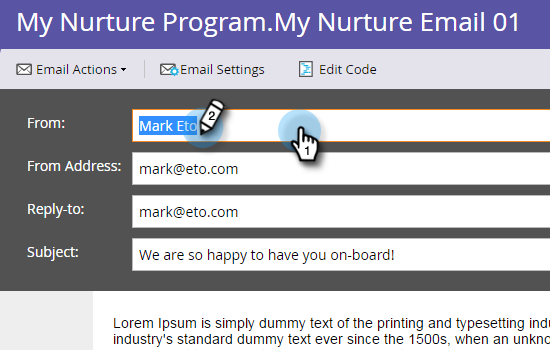
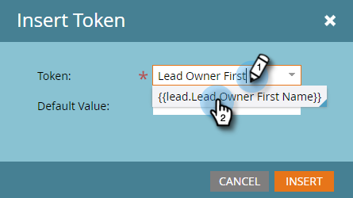

# 个性化电子邮件 {#personalize-an-email}

## 任务：通过添加数据令牌，使电子邮件成为个人电子邮件 {#mission-make-your-emails-personal-by-adding-data-tokens}

>[!PREREQUISITES]
>
>* [设置并添加人员](/help/marketo/getting-started/quick-wins/get-set-up-and-add-a-person.md){target=&quot;_blank&quot;}
>* [发送电子邮件爆炸](/help/marketo/getting-started/quick-wins/send-an-email.md){target=&quot;_blank&quot;}
>* [滴，滴，抚](/help/marketo/getting-started/quick-wins/drip-drip-nurture.md){target=&quot;_blank&quot;}

## 步骤1:选择要个性化的电子邮件 {#step-select-an-email-to-personalize}

1. 选择在 [上一次快速赢](/help/marketo/getting-started/quick-wins/drip-drip-nurture.md){target=&quot;_blank&quot;}，单击 **创建草稿**.

   

   >[!NOTE]
   >
   >这会创建电子邮件的草稿副本。 请记住批准草稿，以使更改上线。

如果尚未启用弹出窗口阻止程序，则电子邮件编辑器将在新的选项卡/窗口中打开。 否则，请单击 **创建草稿** 两次。

## 步骤2:将销售人员设为发件人 {#step-make-the-salesperson-the-sender}

1. 选择 **从** 字段，突出显示和 **删除** 当前名称。

   

1. 单击 **令牌** 图标 **从** 字段。

   

1. 查找并选择 **`{{lead.Lead Owner First Name}}`** 令牌。

   

1. 键入公司名称并短划线 **默认值** 以确保在销售代表的名字不可用时显示某些内容。 单击 **插入**.

   

1. 点击 **从** 字段中，确保光标在刚刚插入的令牌后闪烁一个空格。 然后，单击 **令牌** 图标。

   

1. 查找并选择 **`{{lead.Lead Owner Last Name}}`** 令牌。

   

1. 键入“Sales”作为 **默认值** 单击 **插入**.

   

## 步骤3:将潜在客户的名称添加到电子邮件 {#step-add-the-leads-name-to-the-email}

1. 选择顶部可编辑的部分，单击齿轮图标，然后选择 **编辑**.

   

1. 在“Hello”后面添加一个空格，并将光标放在逗号前面，然后单击 **插入令牌** 图标。

   

1. 查找并选择 **`{{lead.First Name}}`** 令牌。

   

1. 在 **默认值** 字段，单击 **插入**.

   

   >[!TIP]
   >
   >始终包含令牌的默认值；这可确保在缺少部分个人信息时，在电子邮件中显示默认值。

1. 单击 **保存**.

   

1. 在 **电子邮件操作** 选择 **批准并关闭**.

   

>[!TIP]
>
>需要快速刷新一下如何自己发送电子邮件的信息？ 请参阅 [发送电子邮件爆炸](/help/marketo/getting-started/quick-wins/send-an-email.md){target=&quot;_blank&quot;}。

### 任务完成 {#mission-complete}

恭喜，您已经为电子邮件个性化了！

  

[◄任务6:滴，滴，抚](/help/marketo/getting-started/quick-wins/drip-drip-nurture.md)

[任务8:提醒销售代表►](/help/marketo/getting-started/quick-wins/alert-the-sales-rep.md)
