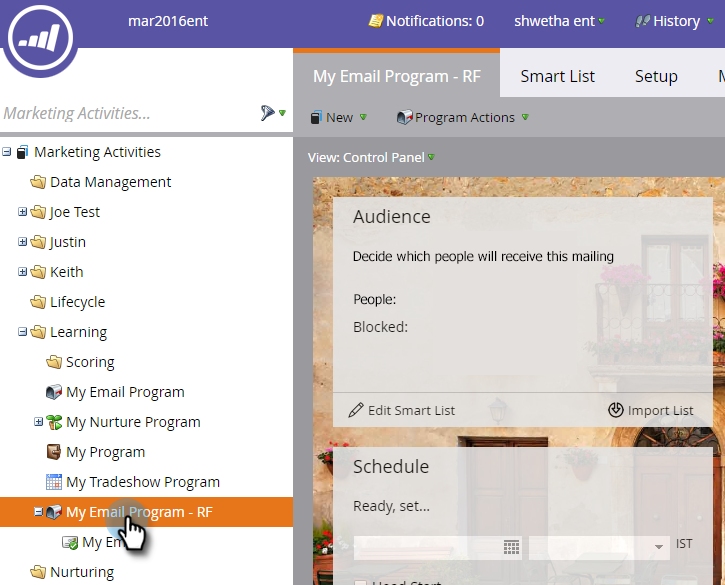
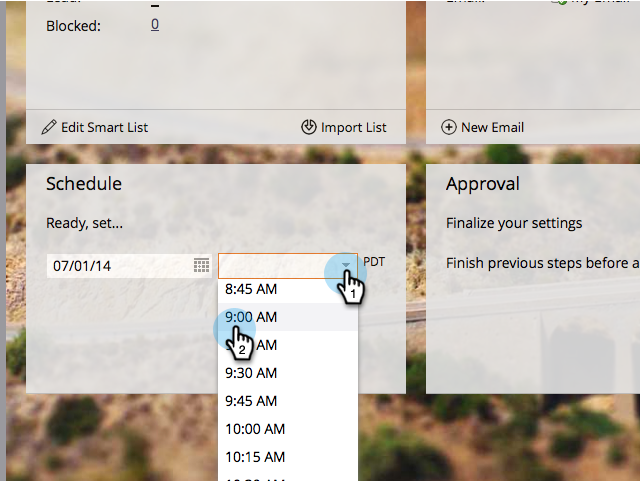

# 发送电子邮件 {#send-an-email}

这是每个人都想做的第一件事。 让我们从Marketo发电子邮件！

>[!PREREQUISITES]
>
>[设置并添加人员](/help/marketo/getting-started/quick-wins/get-set-up-and-add-a-person.md){target=&quot;_blank&quot;}

## 创建电子邮件程序 {#create-an-email-program}

1. 转到 **营销活动** 的上界。

   

1. 选择 **学习** 文件夹。 单击 **新建** 下拉框并选择 **新计划**.

   

1. 输入 **名称** 选择 **电子邮件** 表示 **程序类型。**

   >[!TIP]
   >
   >在程序名称的末尾添加您的缩写，以使其唯一。

   

1. 在 **渠道**，选择 **电子邮件发送** 单击 **创建**.

   

## 定义受众 {#define-your-audience}

1. 单击 **编辑智能列表** 下。

   

1. 查找“电子邮件地址”过滤器并将其拖到画布中。

   

   >[!TIP]
   >
   >使用 **搜索** ，以便更轻松地查找过滤器。

1. 查找并选择您的电子邮件地址。

   

   >[!NOTE]
   >
   >如果您的电子邮件不自动填充，则您可能忘记 [设置并添加潜在客户。](/help/marketo/getting-started/quick-wins/get-set-up-and-add-a-person.md){target=&quot;_blank&quot;}

   >[!NOTE]
   >
   >在本例中，我们仅让您自己发送电子邮件，但您可以根据自己的需要自定义受众。

1. 返回到主项目选项卡，然后单击 **人员**.

   

   你应该看到人数最多1。 就是你！

## 创建电子邮件 {#create-an-email}

1. 在电子邮件拼贴下，单击 **新电子邮件**.

   

1. 输入 **名称**，选择 **模板**，然后单击 **创建**.

   

1. 将打开电子邮件编辑器窗口。 输入的主题长度不超过50个字符（推荐）。

   

   >[!NOTE]
   >
   >如果您有弹出窗口阻止程序，请单击 **编辑草稿** 以输入电子邮件编辑器。

1. 选择要编辑的区域，单击右侧的齿轮图标，然后选择 **编辑** （您还可以双击要编辑的部分）。

   

1. 输入所需内容并单击 **保存**.

   

1. 更改将自动保存。 关闭编辑器选项卡/窗口。

   

1. 单击 **电子邮件操作** 下拉框并选择 **批准**.

   

   >[!TIP]
   >
   >想要向自己发送一个快速示例，以了解在启动之前电子邮件的外观？ 选择 **发送示例** ，或单击 **电子邮件操作** then [**发送示例**](/help/marketo/product-docs/email-marketing/general/creating-an-email/send-a-sample-email.md){target=&quot;_blank&quot;}。

1. 在左侧树中选择电子邮件程序。

   

1. 在“计划”拼贴下，将电子邮件的启动日期设置为 **今天。**

   

1. 选择一个未来至少15分钟的时间。

   

   >[!TIP]
   >
   >默认时区不是您的时区吗？ 了解如何 [在此处更新](/help/marketo/product-docs/administration/settings/select-your-language-locale-and-time-zone.md){target=&quot;_blank&quot;}。

1. 单击 **批准项目** 在“批准”拼贴下，您就完成了！

   

您应会在计划的日/时间后不久收到电子邮件。

## 任务完成！ {#mission-complete}

  

[◄设置并添加人员](/help/marketo/getting-started/quick-wins/get-set-up-and-add-a-person.md)

[任务2:包含表单的登陆页►](/help/marketo/getting-started/quick-wins/landing-page-with-a-form.md)
