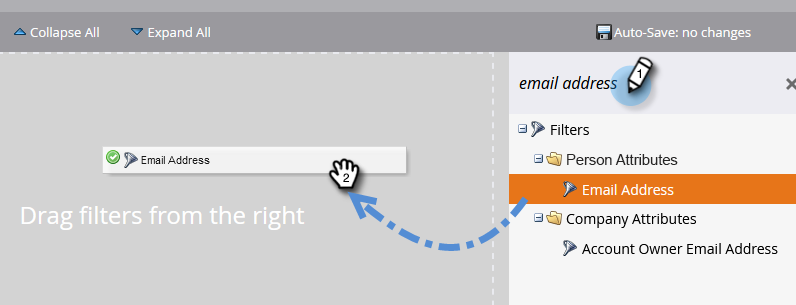

# 发送电子邮件 {#send-an-email}

这是大家最想做的第一件事。让我们从 Marketo 发送一封邮件吧！

>[!PREREQUISITES]
>
>[完成设置并添加人员](/help/marketo/getting-started/quick-wins/get-set-up-and-add-a-person.md){target="_blank"}

## 创建电子邮件项目 {#create-an-email-program}

1. 进入 **[!UICONTROL Marketing Activities]** 区域。

   

1. 选择您的 **[!UICONTROL Learning]** 文件夹。点击 **[!UICONTROL New]** 下拉菜单，并选择 **[!UICONTROL New Program]**。

   

1. 输入 **[!UICONTROL Name]** 并将 **[!UICONTROL Program Type]** 设置为 **[!UICONTROL Email]**。

   >[!TIP]
   >
   >在项目名称末尾添加您的姓名缩写以确保唯一性。

   

1. 在 **[!UICONTROL Channel]** 下，选择 **[!UICONTROL Email Send]** 并点击 **[!UICONTROL Create]**。

   

## 定义您的受众 {#define-your-audience}

1. 在 [!UICONTROL Audience] 模块下点击 **[!UICONTROL Edit Smart List]**。

   

1. 找到并将 [!UICONTROL Email Address] 过滤器拖到画布上。

   

   >[!TIP]
   >
   >使用 **[!UICONTROL Search]** 功能可更轻松查找过滤器。

1. 找到并选择您的电子邮件地址。

   

   >[!NOTE]
   >
   >如果您的电子邮件未自动填充，可能是您忘记执行[完成设置并添加潜在客户。](/help/marketo/getting-started/quick-wins/get-set-up-and-add-a-person.md){target="_blank"}

   >[!NOTE]
   >
   >在此示例中，我们将邮件发送给您自己，但您可以根据需要自定义受众。

1. 返回主项目选项卡，点击 **[!UICONTROL Person]** 的刷新图标。

   

   您应该会看到人员数量增加到 1。那就是您！

## 创建电子邮件 {#create-an-email}

1. 在电子邮件模块下，点击 **[!UICONTROL New Email]**。

   

1. 输入 **[!UICONTROL Name]**，选择&#x200B;**模板**，然后点击 **[!UICONTROL Create]**。

   

1. 电子邮件编辑器窗口将打开。输入主题（建议不超过 50 个字符）。

   

   >[!NOTE]
   >
   >如果您启用了弹出窗口拦截器，请点击 **[!UICONTROL Edit Draft]** 进入电子邮件编辑器。

1. 选择要编辑的区域，点击右侧齿轮图标，然后选择 **[!UICONTROL Edit]**（您也可以双击可编辑区域进行编辑）。

   

1. 输入所需内容并点击 **[!UICONTROL Save]**。

   

1. 点击 **[!UICONTROL Email Actions]** 下拉菜单，并选择 **[!UICONTROL Approve and Close]**。

   

   >[!TIP]
   >
   >想在发布前快速发送样本邮件给自己查看效果吗？在上方菜单中选择 **[!UICONTROL Send Sample]**，或点击 **[!UICONTROL Email Actions]**，然后选择 [**[!UICONTROL Send Sample]**](/help/marketo/product-docs/email-marketing/general/creating-an-email/send-a-sample-email.md){target="_blank"}。

1. 在左侧树状结构中选择电子邮件项目。

   

1. 在 [!UICONTROL Schedule] 模块下，将电子邮件的发送日期设置为 **[!UICONTROL Today]**。

   

   >[!NOTE]
   >
   >进一步了解[收件人时区](/help/marketo/product-docs/email-marketing/email-programs/email-program-actions/scheduling-with-recipient-time-zone/schedule-email-programs-with-recipient-time-zone.md){target="_blank"}和[预启动](/help/marketo/product-docs/email-marketing/email-programs/email-program-actions/head-start-for-email-programs.md){target="_blank"}。

1. 选择一个至少比当前时间晚 15 分钟的时间。

   

   >[!TIP]
   >
   >默认时区不是您的时区吗？了解如何[在此更新它](/help/marketo/product-docs/administration/settings/select-your-language-locale-and-time-zone.md){target="_blank"}。

1. 在 [!UICONTROL Approval] 模块下点击 **[!UICONTROL Approve Program]**，即可完成！

   

您应能在预定日期/时间后不久收到邮件。

## 任务完成！ {#mission-complete}

  

[◄ 完成设置并添加人员](/help/marketo/getting-started/quick-wins/get-set-up-and-add-a-person.md)

[任务 2：带有表单的登陆页面 ►](/help/marketo/getting-started/quick-wins/landing-page-with-a-form.md)
