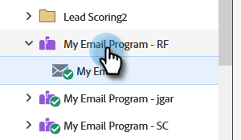

# 发送电子邮件 {#send-an-email}

这是每个人都想做的第一件事。 让我们从Marketo发送电子邮件！

>[!PREREQUISITES]
>
>[设置并添加人员](/help/marketo/getting-started/quick-wins/get-set-up-and-add-a-person.md){target="_blank"}

## 创建电子邮件程序 {#create-an-email-program}

1. 转到&#x200B;**[!UICONTROL 营销活动]**&#x200B;区域。

   

1. 选择您的&#x200B;**[!UICONTROL 学习]**&#x200B;文件夹。 单击&#x200B;**[!UICONTROL 新建]**&#x200B;下拉列表，然后选择&#x200B;**[!UICONTROL 新建项目]**。

   

1. 输入&#x200B;**[!UICONTROL 名称]**&#x200B;并为&#x200B;**[!UICONTROL 计划类型]**&#x200B;选择&#x200B;**[!UICONTROL 电子邮件]**。

   >[!TIP]
   >
   >在程序名称的末尾添加您的缩写以使其唯一。

   

1. 在&#x200B;**[!UICONTROL 渠道]**&#x200B;下，选择&#x200B;**[!UICONTROL 电子邮件发送]**，然后单击&#x200B;**[!UICONTROL 创建]**。

   

## 定义受众 {#define-your-audience}

1. 单击[!UICONTROL 受众]拼贴下的&#x200B;**[!UICONTROL 编辑智能列表]**。

   

1. 查找[!UICONTROL 电子邮件地址]筛选器并将其拖动到画布上。

   

   >[!TIP]
   >
   >使用&#x200B;**[!UICONTROL 搜索]**&#x200B;功能更轻松地查找筛选器。

1. 查找并选择您的电子邮件地址。

   

   >[!NOTE]
   >
   >如果您的电子邮件未自动填充，则您可能忘记[设置并添加潜在客户。](/help/marketo/getting-started/quick-wins/get-set-up-and-add-a-person.md){target="_blank"}

   >[!NOTE]
   >
   >在本例中，我们将让您仅向自己发送电子邮件，但您可以根据需要自定义受众。

1. 返回主项目选项卡，然后单击&#x200B;**[!UICONTROL 人员]**&#x200B;的刷新图标。

   

   您应该看到人员数上升到1。 就是你！

## 创建电子邮件 {#create-an-email}

1. 在“电子邮件”图标下，单击&#x200B;**[!UICONTROL 新建电子邮件]**。

   

1. 输入&#x200B;**[!UICONTROL 名称]**，选择&#x200B;**模板**，然后单击&#x200B;**[!UICONTROL 创建]**。

   

1. 此时将打开电子邮件编辑器窗口。 输入不超过50个字符的主题（推荐）。

   

   >[!NOTE]
   >
   >如果您有弹出窗口阻止程序，请单击&#x200B;**[!UICONTROL 编辑草稿]**&#x200B;以进入电子邮件编辑器。

1. 选择要编辑的区域，单击右侧的齿轮图标，然后选择&#x200B;**[!UICONTROL 编辑]**（也可以双击可编辑部分进行编辑）。

   

1. 输入所需的内容，然后单击&#x200B;**[!UICONTROL 保存]**。

   

1. 单击&#x200B;**[!UICONTROL 电子邮件操作]**&#x200B;下拉列表，然后选择&#x200B;**[!UICONTROL 批准并关闭]**。

   

   >[!TIP]
   >
   >希望向您自己发送一个快速示例，以了解您的电子邮件在启动之前的显示方式？ 在上面的菜单中选择&#x200B;**[!UICONTROL 发送样本]**，或单击&#x200B;**[!UICONTROL 电子邮件操作]**&#x200B;和[**[!UICONTROL 发送样本]**](/help/marketo/product-docs/email-marketing/general/creating-an-email/send-a-sample-email.md){target="_blank"}。

1. 在左侧树中选择Email Program。

   

1. 在[!UICONTROL 计划]拼贴下，将电子邮件的启动日期设置为&#x200B;**[!UICONTROL 今天]**。

   

   >[!NOTE]
   >
   >了解有关[收件人时区](/help/marketo/product-docs/email-marketing/email-programs/email-program-actions/scheduling-with-recipient-time-zone/schedule-email-programs-with-recipient-time-zone.md){target="_blank"}和[Head Start](/help/marketo/product-docs/email-marketing/email-programs/email-program-actions/head-start-for-email-programs.md){target="_blank"}的更多信息。

1. 选择未来至少15分钟的时间。

   

   >[!TIP]
   >
   >默认时区不是您的时区吗？ 在此处了解如何[更新它](/help/marketo/product-docs/administration/settings/select-your-language-locale-and-time-zone.md){target="_blank"}。

1. 单击[!UICONTROL 批准]图块下的&#x200B;**[!UICONTROL 批准项目]**，操作已完成！

   

您应在计划的日期/时间之后不久收到电子邮件。

## 任务完成！ {#mission-complete}

  

[◄设置并添加人员](/help/marketo/getting-started/quick-wins/get-set-up-and-add-a-person.md)

[任务2：带有表单►的登陆页面](/help/marketo/getting-started/quick-wins/landing-page-with-a-form.md)
