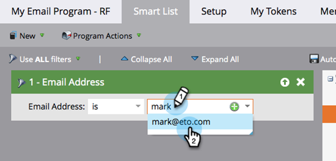

# 发送电子邮件 {#send-an-email}

这是每个人都想做的第一件事。 让我们从Marketo发送电子邮件！

>[!PREREQUISITES]
>
>[设置并添加人员](/help/marketo/getting-started/quick-wins/get-set-up-and-add-a-person.md){target="_blank"}

## 创建电子邮件程序 {#create-an-email-program}

1. 转到 **[!UICONTROL 营销活动]** 区域。

   

1. 选择您的 **[!UICONTROL 学习]** 文件夹。 单击 **[!UICONTROL 新建]** 下拉并选择 **[!UICONTROL 新建项目群]**.

   

1. 输入 **[!UICONTROL 名称]** 并选择 **[!UICONTROL 电子邮件]** 对象 **[!UICONTROL 项目类型]**.

   >[!TIP]
   >
   >在程序名称的末尾添加您的缩写以使其唯一。

   

1. 下 **[!UICONTROL 渠道]**，选择 **[!UICONTROL 电子邮件发送]** 并单击 **[!UICONTROL 创建]**.

   

## 定义受众 {#define-your-audience}

1. 单击 **[!UICONTROL 编辑智能列表]** 在 [!UICONTROL 受众] 磁贴。

   

1. 查找并拖动 [!UICONTROL 电子邮件地址] 过滤到画布上。

   

   >[!TIP]
   >
   >使用 **[!UICONTROL Search]** 函数以便更轻松地查找过滤器。

1. 查找并选择您的电子邮件地址。

   

   >[!NOTE]
   >
   >如果您的电子邮件未自动填充，则您可能忘记了 [完成设置并添加潜在客户。](/help/marketo/getting-started/quick-wins/get-set-up-and-add-a-person.md){target="_blank"}

   >[!NOTE]
   >
   >在本例中，我们将让您仅向自己发送电子邮件，但您可以根据需要自定义受众。

1. 返回主程序选项卡，然后单击的刷新图标 **[!UICONTROL 人员]**.

   

   您应该看到人员数上升到1。 就是你！

## 创建电子邮件 {#create-an-email}

1. 在电子邮件拼贴下，单击 **[!UICONTROL 新建电子邮件]**.

   

1. 输入 **[!UICONTROL 名称]**，选择一个 **模板**，然后单击 **[!UICONTROL 创建]**.

   

1. 此时将打开电子邮件编辑器窗口。 输入不超过50个字符的主题（推荐）。

   

   >[!NOTE]
   >
   >如果您有弹出窗口阻止程序，请单击 **[!UICONTROL 编辑草稿]** 以输入电子邮件编辑器。

1. 选择要编辑的区域，单击右侧的齿轮图标，然后选择 **[!UICONTROL 编辑]** （也可以双击可编辑部分进行编辑）。

   

1. 输入所需的内容并单击 **[!UICONTROL 保存]**.

   

1. 单击 **[!UICONTROL 电子邮件操作]** 下拉并选择 **[!UICONTROL 批准并关闭]**.

   

   >[!TIP]
   >
   >希望向您自己发送一个快速示例，以了解您的电子邮件在启动之前的显示方式？ 选择 **[!UICONTROL 发送示例]** （在上面的菜单中，或单击） **[!UICONTROL 电子邮件操作]** 则 [**[!UICONTROL 发送示例]**](/help/marketo/product-docs/email-marketing/general/creating-an-email/send-a-sample-email.md){target="_blank"}.

1. 在左侧树中选择Email Program。

   

1. 在 [!UICONTROL 计划] 图块，将电子邮件的启动日期设置为 **[!UICONTROL 今天]**.

   

   >[!NOTE]
   >
   >了解有关 [收件人时区](/help/marketo/product-docs/email-marketing/email-programs/email-program-actions/scheduling-with-recipient-time-zone/schedule-email-programs-with-recipient-time-zone.md){target="_blank"} and [Head Start](/help/marketo/product-docs/email-marketing/email-programs/email-program-actions/head-start-for-email-programs.md){target="_blank"}.

1. 选择未来至少15分钟的时间。

   

   >[!TIP]
   >
   >默认时区不是您的时区吗？ 了解如何 [在此处更新它](/help/marketo/product-docs/administration/settings/select-your-language-locale-and-time-zone.md){target="_blank"}.

1. 单击 **[!UICONTROL 批准项目]** 在 [!UICONTROL 批准] 磁贴，你完了！

   

您应在计划的日期/时间之后不久收到电子邮件。

## 任务完成！ {#mission-complete}

  

[◄设置并添加人员](/help/marketo/getting-started/quick-wins/get-set-up-and-add-a-person.md)

[任务2：带有表单►的登陆页面](/help/marketo/getting-started/quick-wins/landing-page-with-a-form.md)
