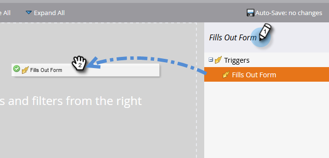

# 简单评分 {#simple-scoring}

>[!PREREQUISITES]
>
>* [设置并添加人员](/help/marketo/getting-started/quick-wins/get-set-up-and-add-a-person.md){target="_blank"}
>* [带有表单的登陆页面](/help/marketo/getting-started/quick-wins/landing-page-with-a-form.md){target="_blank"}

## 步骤1：创建评分营销活动 {#step-create-a-scoring-campaign}

1. 转到 **[!UICONTROL 营销活动]** 区域。

   

1. 右键单击 **学习** 文件夹并单击 **[!UICONTROL 新建Campaign文件夹]**.

   

1. 将活动文件夹命名为“Scoring”，然后单击 **[!UICONTROL 创建]**.

   

   >[!NOTE]
   >
   >如果您已经有一个评分文件夹，请将其命名为其他名称，例如评分1。 文件夹名称必须是唯一的。

1. 右键单击 **得分** 文件夹并选择 **[!UICONTROL 新建智能营销活动]**.

   

1. 将营销活动命名为“Change Score”，然后单击 **[!UICONTROL 创建]**.

   

1. 单击 **[!UICONTROL 智能列表]** 选项卡。

   

   我们希望每当有人填写您的 **试用申请表**.

1. 查找并拖动 **[!UICONTROL 填写表单]** 在左画布上触发。

   

1. 选择 **我的表单**.

   

   >[!NOTE]
   >
   >如果您已完成 [带有表单的登陆页面](/help/marketo/getting-started/quick-wins/landing-page-with-a-form.md){target="_blank"} 速战速决，你应该有表格的。 如果表单使用了其他名称，请选择该名称。

1. 单击 **[!UICONTROL 流量]** 选项卡。

   

1. 拖动 **更改得分** “流”操作在左侧画布上。

   

1. 您可以键入要添加到人员得分的任何值。 我们来输入“+5” **[!UICONTROL 更改]** 字段。

   

   >[!TIP]
   >
   >良好的评分活动是向销售人员提供高质量人员的关键。 读取 [**引导评分的最终指南**](https://www.marketo.com/definitive-guides/lead-scoring/){target="_blank"}.

1. 单击 **[!UICONTROL 计划]** 选项卡和 **[!UICONTROL 激活]** 按钮。

   

1. 单击 **[!UICONTROL 激活]** 在确认屏幕上。

   

>[!NOTE]
>
>一旦激活，此营销活动将在每次用户填写表单时运行。 该营销活动将继续运行，直到被停用。

## 第2步：填写表单 {#step-fill-out-the-form}

1. 选择您在中创建的登陆页面 [带有表单的登陆页面](/help/marketo/getting-started/quick-wins/landing-page-with-a-form.md){target="_blank"} 快赢。

   

1. 单击 **[!UICONTROL 预览]**. 登陆页面将在新选项卡中打开。

   

1. 填写您的名字、姓氏和电子邮件地址，然后单击 **[!UICONTROL 提交]**.

   

   >[!NOTE]
   >
   >使用您首次以个人身份输入时所用的相同名称和电子邮件地址，以应用“+5”分数提升。

## 步骤3：查看人员信息 {#step-view-the-person-info}

1. 转到 **[!UICONTROL 数据库]** 区域。

   

1. 搜索您在填写表单时使用的电子邮件地址。

   

1. 双击您的人员。

   

将在新选项卡或窗口中打开您的人员详细信息。 了解填写表单后得分如何提高5分？

## 任务完成！ {#mission-complete}

  

[◄任务2：带有表单的登陆页面](/help/marketo/getting-started/quick-wins/landing-page-with-a-form.md)

[任务4：电子邮件自动响应►](/help/marketo/getting-started/quick-wins/email-auto-response.md)
