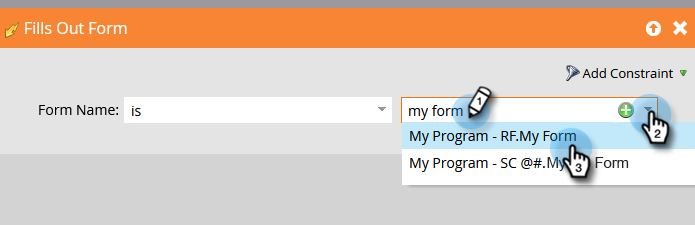

# 简单评分 {#simple-scoring}

>[!PREREQUISITES]
>
>* [设置并添加人员](/help/marketo/getting-started/quick-wins/get-set-up-and-add-a-person.md){target=&quot;_blank&quot;}
>* [包含表单的登陆页面](/help/marketo/getting-started/quick-wins/landing-page-with-a-form.md){target=&quot;_blank&quot;}

## 步骤1:创建评分营销活动 {#step-create-a-scoring-campaign}

1. 转到 **营销活动** 的上界。

   

1. 右键单击 **学习** 文件夹，单击 **新建Campaign文件夹**.

   

1. 将营销活动文件夹命名为“Scoring”，然后单击 **创建**.

   

   >[!NOTE]
   >
   >如果您已经有“评分”文件夹，请将其命名为其他名称，如“评分1”。 文件夹名称必须唯一。

1. 右键单击 **评分** 文件夹，选择 **新的智能营销活动**.

   

1. 将营销活动命名为“Change Score”，然后单击 **创建**.

   

1. 单击 **智能列表** 选项卡。

   

   我们希望，每当某人填写您的 **试用申请表**.

1. 查找并拖动 **填写表单** 触发到左画布。

   

1. 选择 **我的表单**.

   

   >[!NOTE]
   >
   >如果您完成了 [包含表单的登陆页面](/help/marketo/getting-started/quick-wins/landing-page-with-a-form.md){target=&quot;_blank&quot;}快速获胜，您应该有表单。 如果您为表单使用了其他名称，请选择该名称。

1. 单击 **流量** 选项卡。

   

1. 拖动 **更改分数** “流”操作。

   

1. 您可以键入要添加到人员分数的任何值。 让我们在 **更改** 字段。

   

   >[!TIP]
   >
   >良好的营销活动是向销售人员提供高质量人员的关键。 读取 [**最终领先评分指南**](https://www.marketo.com/definitive-guides/lead-scoring/){target=&quot;_blank&quot;}。

1. 单击 **计划** 选项卡 **激活** 按钮。

   

1. 单击 **激活** 在确认屏幕上。

   

>[!NOTE]
>
>活动后，此营销活动将在每次人员填写表单时运行。 营销活动将一直运行，直到停用为止。

## 步骤2:填写表格 {#step-fill-out-the-form}

1. 选择您在 [包含表单的登陆页面](/help/marketo/getting-started/quick-wins/landing-page-with-a-form.md){target=&quot;_blank&quot;}快速获胜。

   

1. 单击 **预览**. 登陆页面将在新选项卡中打开。

   

1. 在表单中填写名字、姓氏和电子邮件地址，然后单击 **提交**.

   

   >[!NOTE]
   >
   >使用您首次以个人身份输入自己时使用的相同名称和电子邮件地址，以应用“+5”分数增加。

## 步骤3:查看人员信息 {#step-view-the-person-info}

1. 转到“数据库”区域。

   

1. 搜索您在填写表单时使用的电子邮件地址。

   

1. 双击您的人。

   

您的人员详细信息将在新选项卡或窗口中打开。 看看你填表时的分数是如何增加5分？

## 任务完成！ {#mission-complete}

  

[◄任务2:包含表单的登陆页面](/help/marketo/getting-started/quick-wins/landing-page-with-a-form.md)

[任务4:电子邮件自动响应►](/help/marketo/getting-started/quick-wins/email-auto-response.md)
