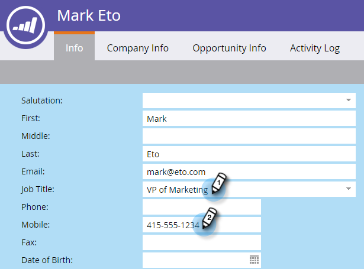

# 更新人员数据{#update-person-data}

## 任务：更新人员的联系信息或其他数据{#mission-update-a-persons-contact-info-or-other-data}

>[!PREREQUISITES]
>
>* [设置并添加人](/help/marketo/getting-started/quick-wins/get-set-up-and-add-a-person.md)
>* [导入人员列表](/help/marketo/getting-started/quick-wins/import-a-list-of-people.md)

让我们想象一下，在您最近的展会上，有人给您提供了一些额外的联系信息。 下面介绍如何更新个人数据。

## 查找需要更新{#find-the-person-you-need-to-update}的人

1. 转到数据库。

   

1. 搜索人员的姓名或电子邮件地址。

   >[!TIP]
   >
   >使用电子邮件地址进行搜索可加快搜索速度。

   

1. 多次单击可打开人员详细信息。

   

   >[!TIP]
   >
   >在Marketo中，有多种方法可更新人员数据。 请参阅[导入People](/help/marketo/getting-started/quick-wins/import-a-list-of-people.md)和[更改列表值](/help/marketo/product-docs/core-marketo-concepts/smart-campaigns/flow-actions/change-data-value.md)的数据。

## 更新人员数据{#update-the-person-data}

1. 键入您收到的新信息，然后关闭选项卡。

>[!NOTE]
>
>更改数据后，智能列表和智能活动将立即识别新信息。

## 任务完成{#mission-complete}

干得好！ 您更新了您的个人数据。

  

[◄任务8:提醒销售代表](/help/marketo/getting-started/quick-wins/alert-the-sales-rep.md)

[任务10:重定向登陆页►](/help/marketo/getting-started/quick-wins/redirect-a-landing-page.md)
