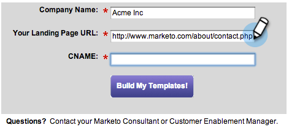

# 设置步骤 {#setup-steps}

**马克托欢迎你！**

在开始使用Marketo之前，您需要完成几个步骤。

这些步骤包括：

* 一些基本帐户设置
* 品牌化登陆页URL和电子邮件链接，以提高信任度和交付能力
* 同步您的CRM
* 将跟踪代码添加到公司网站

>[!NOTE]
>
>只有在公司是Marketo新用户时，您才需 **要执行这些步骤**。 否则，安装可能已完成。

某些步骤需要IT团队的帮助。

>[!TIP]
>
>如果打 [印出此核对清单](/help/marketo/getting-started/setup-steps/setup-checklist.md)，您可以在完成项目时将其签出。

1. 登录并创建其他Marketo用户

1. 使用您通过电子邮件 [收到](https://app.marketo.com/) 的凭据，在此登录到Marketo。

   

恭喜！ 您现在在Marketo，可以开始探索。 您可能希望邀请营销团队中的同事加入您。 您可以通过添加新用户来完成此操作。

转到“管 **理** ”区域。

>[!TIP]
>
>在此时，您可以单击“我的 **帐户** ”来更改您的帐户和位置设置，并设置新的订阅名称。

>[!NOTE]
>
>**需要管理员权限**

单击“ **用户和角色”**。

单击“ **邀请新用户**”。

填写您同事的电子邮件地址、名字和姓氏。

（可选）使用日历选取器输入邀请原因和访问到期日期。 单击 **确定**。

单击“ **下一步**”。

>[!TIP]
>
>到期日对短期外部利益相关方或顾问非常有用，他们需要Market才能短暂访问。

>[!NOTE]
>
>到期日期到来时，用户收到过期通知，帐户被锁定。

选择一个角色，然后单击“ **下一步**”。 标准用户有权访问除管理员以外的所有区域。

>[!NOTE]
>
>除了五个内置角色之外，您还可以创建自定义角色。 了解有关管理用 [户角色和权限的更多信息](/help/marketo/product-docs/administration/users-and-roles/managing-user-roles-and-permissions.md)。

您可以随意调整邀请文本。 单击“ **发送**”。

新用户现在列在“用户”选项卡中，应会收到一封电子邮件，其中包含创建口令和登录名的链接。 下一步！

1. 设置授权支持联系人

   您可能已收到Marketo Support的电子邮件，声明您是公司的Marketo Customer Support Administrator。 如果是，您可以为团队 **设置授权支持** 联系人。 只有授权的支持联系人才能直接通过Marketo支持门户与Marketo [客户支持联系](https://support.marketo.com)。

   >[!NOTE]
   >
   >您可以创建的支持联系人数量取决于您购买的包。 此限制在您从营销人员支持部门发送的电子邮件中指定。

   授权支持联系文档已移至Marketo社区。 请参阅 [本文](https://nation.marketo.com/t5/Knowledgebase/Managing-Authorized-Support-Contacts/ta-p/254341)。

   >[!NOTE]
   >
   >只有登录到Marketo Community的人员才会出现在列表中。 如果找不到该人，请确保他们首先登录到社区。

1. 使用CNAME自定义登陆页URL

   >[!NOTE]
   >
   >您是Launch Pack客户吗？ 您可以跳过此步骤。 在启动电话联系过程中，顾问将为您提供IT设置说明文档。

   >[!NOTE]
   >
   >**需要管理员权限**

   为登陆页选择CNAME。 一些示例：

   * **去**。[CompanyDomain].com
   * **www2**.[CompanyDomain].com
   * **lp**.[CompanyDomain].com

   >[!TIP]
   >
   >保持简短！ 更短的URL更易于记忆。 我们建议把“go”作为域。

   第一部分（以粗体显示）是 `[LandingPageCNAME]`。 您将在步骤5中需要它。

   要检索将用登陆页CNAME替换的帐户字符串，请转至管理区域。

   

   单击 **登陆页**。

   

   从登陆页设置复制帐户字符串。

   

   这是 `[AccountString]`。 保存它。 您需要在步骤5中将它交给IT。

配置域设置，使登陆页使用公司的域而不是Marketo的域（托管地）。

1. 确保电子邮件可发送

   >[!NOTE]
   >
   >您是Launch Pack客户吗？ 您可以跳过此步骤。 在启动电话联系过程中，顾问将为您提供IT设置说明文档。

   您可以采取多种措施来确保电子邮件能够触及尽可能多的用户。

   1. **标记您的跟踪链接**。 您可以选择CNAME，在您从Marketo发送的电子邮件中包含的链接中使用您自己的域（而非Marketo）。 这增强了您的域品牌，并增强了收件人的信任和交付能力。
   1. **将Market添加到您的公司电子邮件允许列表。** 通常，在向实际人员发送电子邮件之前，先将测试电子邮件发送到测试帐户是最佳做法。 通过列入允许列表Marketo，您可以防止这些测试电子邮件被阻止或标记为垃圾邮件。
   1. **设置SPF和DKIM。** 这些技术可以向您的收件人保证您的Marketo电子邮件不是垃圾邮件。 为了防止收件人的垃圾邮件过滤器拒绝您的Marketo电子邮件，请按照以下步骤 [为您的电子邮件可交付性设置SPF和DKIM](/help/marketo/product-docs/email-marketing/deliverability/set-up-spf-and-dkim-for-your-email-deliverability.md)。
   1. **为域设置MX记录。** MX记录允许您接收发送电子邮件到域的邮件，以处理回复和自动回复。 如果从公司域发送，您可能已配置了此配置。 否则，您通常可以设置为映射到公司域的MX记录。
   1. **建议的发件人地址设置。** 您必须在所有电子邮件活动的发件人地址中使用有效、现有且有效的电子邮件域。 配置公司域的子域可能会有所裨益，而不是从公司域发送。 这将确保您的公司邮件流的问题不会影响您的Marketo邮件流，反之亦然。 此外，从something@nonexistentdomain.com发送邮件会导致电子邮件被过滤或阻止。 发件人发件人地址中使用的任何域都必须具有有效且有效的postmaster@和upase@帐户。
如果您使用Google Apps托管您的公司电子邮件，您将无法在您的域下创建ubase@或postmaster@电子邮件。 要解决这个问题，您需要创建名为“滥用”和“邮递员”的组。 属于这些用户组的用户将收到发送到这些地址的电子邮件(例如postmaster@domain.com)。 有关创建组的详细说明，请 [访问](https://support.google.com/a/answer/33343#adminconsole)。

   为电子邮件跟踪链接选择CNAME(选择一个与您在 _步骤_ 3中选择的登陆页CNAME不同的CNAME)。 一些示例：

   * go2.[CompanyDomain].com
   * em.[CompanyDomain].com
   * 哇。[CompanyDomain].com

   第一部分是电子邮件跟踪CNAME `[EmailTrackingCNAME]`。 您需要在步骤5中将其交给IT部门。

   >[!CAUTION]
   >
   >电子邮件和登陆页CNAME必须不同。 此外，避免使用“track”或“link”等CNAME。 它通常被标记为垃圾邮件

   要查找您的Marketo跟踪链接，请转至“管 **理** ”区域。

   

   单击“ **电子邮件**”。

   

   从电子邮件设置中复制跟踪链接。

   跟踪链接的形式为： `mkto-[a-z][4 digits].com`.

   

   这是你的 `[MktoTrackingLink]`。 保存它。 您需要在步骤5中将它交给IT。

   收集“发件人”域。 列表您计划用于从Marketo发送电子邮件的所 `[Sender]@[FromDomain].com`有“发件人”域（如中）。 对大多数人来说，只有一个。

   例如，“marketo.com”、“info.marketo.com”。 这些 `[FromDomain1]`是`[FromDomain2]`，等等。 保存它们。 您需要在步骤5中将它们交给IT部门。

   您现在可以获得向IT部门发送请求所需的所有信息！

1. 要求IT人员配置协议

   >[!NOTE]
   >
   >您是Launch Pack客户吗？ 您可以跳过此步骤。 在启动电话联系过程中，顾问将为您提供IT设置说明文档。

   收集所有必要信息后，即可向IT部门发送请求。 您可以使用下面的文本作为模板，用您自己的信息替换粗体文本。

   [包含指向此文章的链接](/help/marketo/getting-started/setup-steps/configure-protocols-for-marketo.md)。

   将此文本粘贴到电子邮件中，并替换加粗括号的占位符：

   >[!NOTE]
   >
   >请参阅上面的步骤3和4，确定要替换占位符的文本。 记住这 `[LandingPageCNAME]` 一点， `[EmailTrackingCNAME]` 必须不同。

`---------------------------------------------`

尊敬的IT管理员：

我们的营销团队现在正在使用Marketo平台与我们的员工进行交流。 为确保电子邮件的发送能力，我们需要进行以下更改：

`1)` 对于我们的登陆页，为LandingPageCNAME添加DNS项( **[CNAME)]**。**[CompanyDomain]**.com，指 **[向AccountString]**.mktoweb.com。

`2)` 对于我们在电子邮件中的跟踪链接，请为EmailTrackingCNAME添加一个DNS **[条目(CNAME)]**。**[CompanyDomain]**.com，指 **[向MktoTrackingLink]**。

`3)` 允许列表 Marketo。

    *如果我们在电子邮件允许列表卡中使用IP地址，请添加以下列IP:
    199.15.212.0/22
    
    192.28.144.0/20
    
    192.28.160.0/19
    
    185.28.196.0/22
    
    130.248.172.0/24
    
    130.248.173.0/24
    
    
    
    103.237.104.0/2294.236.119.0/26

注意：如果您希望列表IP以特定于您的环境，请允许列表联系营销人员支持。

    *如果我们的防垃圾邮件系统使用“发件人”域，请添加以下内容：

**`[FromDomain1]`**
**`[FromDomain2]`**

`4)` 我们需要设置SPF和DKIM，这样Marketo才有权代表我们发送已签名的电子邮件。

`a.` 要设置SPF，请在DNS条目中添加以下行：

在域的 **[TXT中]**: v=spf1 mx ip4:**[公司IP]** 包括：mktomail.com ~all

如果我们的DNS条目中已有SPF记录，只需在其中添加以下内容：

include:mktomail.com

`[`将“ **来自域** ”替换为“来自域的电子邮件”(例如：公司.com) **和CorpIP** （包含您的公司电子邮件服务器的IP地址）(例如：255.255.255.255)。  如果您要通过Marketo从多个域发送电子邮件，您应让IT人员为每个域添加此行（在一行中）。`]`

`b.` 对于DKIM，请为要设置的每个域创建DNS资源记录。 以下是我们将为每个域签名的主机记录和TXT值：

**`[DKIMDomain1]`**:主机记录 **`[HostRecord1]`** 为，TXT值为 **[TXTValue1]**。

**`[DKIMDomain2]`**:主机记录 **`[HostRecord2]`** 为，TXT值为 **`[TXTValue2]`**。

`[`按照此处 **的说明** ，为您设置的每 **个DKIMDomain复制******HostRecord和TXTValue。 在您的IT员工完成此步骤后，请 **不要忘记在“管理员”>** “电子邮件”>“DKIM”中验证每个域。`]`

`5)` 我们需要确保我们的FROM域FromDomain1、FromDomain2 **[等有]**&#x200B;效 **[的MX记]**&#x200B;录。 你能确认吗？ 否则，请配置为映射到我们的公司域MX记录。 这将确保我们能够处理对我们的营销人员邮件的回复／自动回复。

当您完成这些步骤后，请告诉我，以便我可以使用Marketo完成设置过程。

谢谢！ 你是最棒的！

爱，

**`[Your Name]`**

`---------------------------------------------`

向IT人员发送电子邮件。 我们了解IT可能需要一些时间才能完成这些任务。 您可以继续执行步骤7，但请记住，您必须返回步骤6才能完成Marketo设置。

1. 在IT完成后完成您的营销人员设置

   IT部门完成任务后，请按照以下步骤添加登陆页和电子邮件CNAME并激活DKIM签名。

   转到“管 **理** ”区域添加登陆页CNAME

   

   选择登陆页，然后 **在“** Settings”（设置）区域中单击“Edit”（编辑）。

   

   在“域名”字段中输入新域名以供登陆页使用。 应采用以下形式：

   `[LandingPageCNAME].[CompanyDomain].com`

   

   在回退页面字段中，输入您希望用户在登陆页不可用时转到的URL。 如果您没有备用页面，则可以使用公司主页。 在主页字段中，输入您的公司网站。

   

   在“管理员”区域，选择“电子邮件”以添加您的电子邮件CNAME

   

   向下滚动并单击“ **编辑**”。

   

   在域字段中，输入您的电子邮件跟踪域。 应采用以下形式：

   `[EmailTrackingCNAME].[CompanyDomain].com`. 单击 **保存**。

   

1. 提交登陆页和电子邮件模板的URL

   我们的创意设计人员可以为您提供自定义的电子邮件和登陆页模板，让您快速、轻松地启动营销项目。 您需要为他们提供一些信息，以便他们能够将模板与您的公司网站和徽标匹配起来。

   >[!NOTE]
   >
   >这些自定义模板仅对Launch Pack客户可用。

   转到“Marketo [模板设计和构建”表单](http://pages2.marketo.com/CESubmit-URL-ForTemplates.html) 。 填写您的公司信息。

   

   在登陆页URL中，输入公司网站中显示公司颜色、徽标和样式的示例URL。 大多数客户使用包含表单的“联系我们”页面。

   

   对于CNAME，输入您在步骤3()中选择的登陆页`[LandingPageCNAME]`CNAME。 提交您的请求。

   

   >[!NOTE]
   >
   >只有在IT为您的登陆页CNAME创建DNS记录之前，模板才能完成。

   就是这样！ 您应在3-5个工作日内在Marketo Design Studio中查看新模板。

1. 集成您的CRM

   这可能是您设置过程中最激动人心的一步——是时候让Market充满您存储在CRM中的所有这些潜在客户和联系人了！

   根据公司使用的CRM，从以下选项中进行选择。

   * [将Marketo与Salesforce.com集成](/help/marketo/product-docs/crm-sync/salesforce-sync/understanding-the-salesforce-sync.md)
   * [将Marketo与Microsoft Dynamics集成](/help/marketo/product-docs/crm-sync/microsoft-dynamics-sync/understanding-the-microsoft-dynamics-sync.md)

   >[!NOTE]
   >
   >您需要公司的CRM管理员的协助才能完成这些步骤。

## 9.将跟踪代码添加到您的网站 {#add-tracking-code-to-your-website}

>[!NOTE]
>
>您是Launch Pack客户吗？ 您可以跳过此步骤。 您的顾问将在您的IT设置说明文档中为您提供Munchkin代码说明。

Marketo具有自定义跟踪JavaScript（称为Munchkin），可用于跟踪任何网页上的人员活动。 Munchkin需要将您的网站集成到Marketo中。 按照以下步骤将 [Munchkin跟踪代码添加到您的网站](/help/marketo/product-docs/administration/additional-integrations/add-munchkin-tracking-code-to-your-website.md)。

>[!NOTE]
>
>体验添加跟踪代码所需的HTML。

您的所有设置步骤都结束了。 只剩下一件事就是投入使用Marketo!
