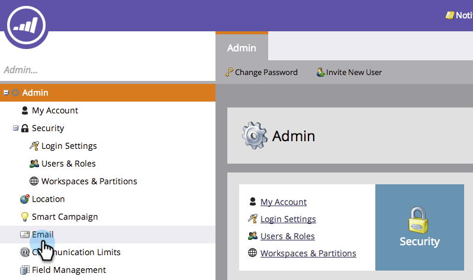

# 设置步骤{#setup-steps}

**Marketo欢迎你！**

在开始使用Marketo之前，您需要先完成几个步骤。

这些步骤包括：

* 基本帐户设置
* 品牌化登陆页URL和电子邮件链接，以提高信任度和交付能力
* 同步您的CRM
* 将跟踪代码添加到您的公司网站

>[!NOTE]
>
>仅当您的公司&#x200B;**是Marketo**&#x200B;的新用户时，才需要执行这些步骤。 否则，安装可能已完成。

某些步骤需要IT团队的帮助。

>[!TIP]
>
>如果[打印出此清单](/help/marketo/getting-started/setup-steps/setup-checklist.md)，则可在完成项目时将其检出。

## 登录并创建其他Marketo用户{#log-in-and-create-additional-marketo-users}

1. 使用您通过电子邮件收到的凭据登录Marketo [此处](https://app.marketo.com/)。

   

祝贺您！您现在在Marketo，可以开始探索。 您可能希望邀请营销团队中的同事加入您的行列。 您可以通过添加新用户来执行此操作。

转至&#x200B;**Admin**&#x200B;区域。

>[!TIP]
>
>在此处时，您可以单击&#x200B;**我的帐户**&#x200B;更改帐户和位置设置，并设置新的订阅名称。

>[!NOTE]
>
>**需要管理权限**

单击&#x200B;**用户和角色**。

单击&#x200B;**邀请新用户**。

填写您同事的电子邮件地址、名字和姓氏。

（可选）使用日历选取器输入邀请的原因和访问过期日期。 单击&#x200B;**确定**。

单击&#x200B;**下一步**。

>[!TIP]
>
>截止日期对短期外部利益相关方或顾问非常适合，他们只需在短时间内访问Marketo。

>[!NOTE]
>
>到期日期到达时，用户会收到到期通知，并且帐户已锁定。

选择角色，然后单击&#x200B;**下一步**。 “标准用户”有权访问除“管理员”之外的所有区域。

>[!NOTE]
>
>除了五个内置角色，您还可以创建自定义角色。 了解有关[管理用户角色和权限](/help/marketo/product-docs/administration/users-and-roles/managing-user-roles-and-permissions.md)的更多信息。

请随意调整邀请文本。 单击&#x200B;**发送**。

新用户现在列在“用户”选项卡中，并应会收到一封电子邮件，其中包含用于创建口令和登录名的链接。 下一步！

## 设置授权支持联系人{#set-up-your-authorized-support-contacts}

您可能已收到Marketo支持的电子邮件，声明您是公司的Marketo客户支持管理员。 如果是，您可以为您的团队设置&#x200B;**授权支持联系人**。 只有授权的支持联系人才能通过[Marketo支持门户](https://support.marketo.com)直接与Marketo客户支持联系。

>[!NOTE]
>
>您可以创建的支持联系人数取决于您购买的包。 此限制在您来自Marketo支持部门的电子邮件中指定。

授权支持联系文档已移至Marketo社区。 请参阅[本文](https://nation.marketo.com/t5/Knowledgebase/Managing-Authorized-Support-Contacts/ta-p/254341)。

>[!NOTE]
>
>只有登录到Marketo社区的人才会出现在列表中。 如果找不到该人，请确保他们首先登录到社区。

## 使用CNAME {#customize-your-landing-page-urls-with-a-cname}自定义登陆页URL

>[!NOTE]
>
>您是Launch Pack客户吗？ 您可以跳过此步骤。 在启动电话联系期间，顾问将为您提供IT设置说明文档。

>[!NOTE]
>
>**需要管理权限**

为登陆页选择CNAME。 一些示例：

    **去**。[CompanyDomain].com
    * **ww2**。[CompanyDomain].com
    * **lp**。[CompanyDomain].com

>[!TIP]
>
>保持短！ 更短的URL更易于记忆。 我们建议把“go”作为域。

第一部分（粗体）是`[LandingPageCNAME]`。 在步骤5中，您需要它。

要检索将用您的登陆页CNAME替换的帐户字符串，请转至“管理员”区域。

单击&#x200B;**登陆页**。

从登陆页设置复制帐户字符串。

这是`[AccountString]`。 保存它。 您需要在步骤5中将其交给IT部门。

配置域设置，使登陆页使用公司的域，而不是Marketo的域（托管地）。

## 确保电子邮件可发送性{#ensure-email-deliverability}

>[!NOTE]
>
>您是Launch Pack客户吗？ 您可以跳过此步骤。 在启动电话联系期间，顾问将为您提供IT设置说明文档。

您可以采取多种措施来确保电子邮件能够触及尽可能多的用户。

    1.**为您的跟踪链接打上品牌**。 您可以选择CNAME，在您从Marketo发送的电子邮件中包含的链接中使用您自己的域(而非Marketo的域)。 这增强了您的域品牌，并增强了您对收件人的信任和交付能力。
    1.**将Marketo添加到您的企业电子邮件允许列表。**在向实际人员发送电子邮件之前，先将测试电子邮件发送到测试帐户是一种常见的最佳实践。 通过列入允许列表使用Marketo，您可以防止这些测试电子邮件被阻止或标记为垃圾邮件。
    1.**设置SPF和DKIM。**这些技术可以向您的收件人保证您的Marketo电子邮件不是垃圾邮件。 要帮助防止收件人的垃圾邮件过滤器拒绝您的Marketo电子邮件，请按照以下步骤执行[为您的电子邮件可发送性设置SPF和DKIM](/help/marketo/product-docs/email-marketing/deliverability/set-up-spf-and-dkim-for-your-email-deliverability.md)。
    1.**设置域的MX记录。** MX记录允许您从发送电子邮件的域接收邮件，以处理回复和自动回复。 如果从公司域发送，您可能已经配置了此配置。 否则，您通常可以设置为映射到公司域的MX记录。
    1.**建议的发件人地址设置。**您必须在所有电子邮件活动的“发件人地址”中使用有效、现有和有效的电子邮件域。 配置公司域的子域（而不是从公司域发送）可能会有帮助。 这将确保公司邮件流中的问题不会影响Marketo邮件流，反之亦然。 此外，从something@nonexistentdomain.com发送邮件会导致电子邮件被过滤或阻止。 发件人发件人地址中使用的任何域都必须具有有效的、有效的postmaster@和ubase@帐户。
    如果您使用Google Apps托管您的公司电子邮件，则无法在您的域下创建ubase@或postmaster@电子邮件。要绕过这一点，您需要创建名为“滥用”和“邮政主管”的组。 属于这些组的成员的用户将收到发送到这些地址(例如postmaster@domain.com)的电子邮件。 有关创建组的详细说明，请参阅[此处](https://support.google.com/a/answer/33343#adminconsole)。

为电子邮件跟踪链接选择CNAME(从您在步骤3中选择的登陆页CNAME中选择一个&#x200B;_不同的_)。 一些示例：

    * go2.[CompanyDomain].com
    * em.[CompanyDomain].com
    *哇。[CompanyDomain].com

第一部分是电子邮件跟踪CNAME `[EmailTrackingCNAME]`。 您需要在步骤5中将其交给IT部门。

>[!CAUTION]
>
>电子邮件和登陆页CNAME必须不同。 此外，请避免CNAME（如“track”或“link”）。 它通常被标为垃圾邮件

要查找Marketo跟踪链接，请转至&#x200B;**Admin**&#x200B;区域。

单击&#x200B;**电子邮件**。

从电子邮件设置中复制跟踪链接。

“跟踪链接”的形式为：`mkto-[a-z][4 digits].com`。

这是您的`[MktoTrackingLink]`。 保存它。 您需要在步骤5中将其交给IT部门。

收集“发件人”域。 列表您计划用于从Marketo发送电子邮件的所有“发件人”域（如`[Sender]@[FromDomain].com`）。 对大多数人来说，只有一个。

例如，“marketo.com”、“info.marketo.com”。 这些是`[FromDomain1]`、`[FromDomain2]`等。 拯救他们。 在步骤5中，您需要将它们交给IT部门。

您现在拥有将请求发送给IT部门所需的所有信息！

## 要求IT配置协议{#ask-it-to-configure-protocols}

>[!NOTE]
>
>您是Launch Pack客户吗？ 您可以跳过此步骤。 在启动电话联系期间，顾问将为您提供IT设置说明文档。

收集所有必要信息后，即可向IT部门发送请求。 您可以使用下面的文本作为模板，用您自己的信息替换粗体文本。

[包含指向此文章的链接](/help/marketo/getting-started/setup-steps/configure-protocols-for-marketo.md)。

将此文本粘贴到电子邮件中，并替换加粗的占位符：

>[!NOTE]
>
>请参阅上面的步骤3和4，确定要替换占位符的文本。 请记住，`[LandingPageCNAME]`和`[EmailTrackingCNAME]`必须不同。

`---------------------------------------------`

尊敬的IT管理员：

我们的营销团队现在正在使用Marketo平台与我们的员工进行沟通。 为确保电子邮件的发送能力，我们需要进行以下更改：

`1)` 对于我们的登陆页，为LandingPageCNAME添加DNS项( **[CNAME)]**。**[CompanyDomain]**.com，指 **[向AccountString]**.mktoweb.com。

`2)` 对于我们在电子邮件中的跟踪链接，请为EmailTrackingCNAME添加DNS项( **[CNAME)]**。**[CompanyDomain]**.com，指向 **[MktoTrackingLink]**。

`3)` 允许列表Marketo。

    *如果我们在电子邮件允许列表中使用IP地址，请添加以下列IP:
    199.15.212.0/22
    
    192.28.144.0/20
    
    192.28.160.0/19
    
    185.28.196.0/22
    
    130.248.172.0/24
    
    130.248.173.0/24
    
    
    
    103.237.104.0/2294.236.119.0/26

注意：如果您希望IP的缩写列表特定于您的环境，请允许列表联系Marketo支持部门。

    *如果我们的防垃圾邮件系统使用“发件人”域，则添加以下内容：

**`[FromDomain1]`**
**`[FromDomain2]`**

`4)` 我们需要设置SPF和DKIM，以便Marketo有权代表我们发送已签名的电子邮件。

`a.` 要设置SPF，请在DNS条目中添加以下行：

IN TXT **[从域]**: v=spf1 mx ip4:**[公司IP]**
 包括：mktomail.com ~all

如果我们的DNS条目中已有SPF记录，只需在其中添加以下内容：

include:mktomail.com

`[`将域 **中** 的电子邮件替换为域中的电子邮件(例如：公司.com)和 **** CorpIP与您公司电子邮件服务器的IP地址(例如：255.255.255.255)。如果要通过Marketo从多个域发送电子邮件，您应让IT人员为每个域添加此行（在一行上）。`]`

`b.` 对于DKIM，请为我们要设置的每个域创建DNS资源记录。以下是我们将要签名的每个域的主机记录和TXT值：

**`[DKIMDomain1]`**:主机记 **`[HostRecord1]`** 录为，TXT值为 **[TXTValue1]**。

**`[DKIMDomain2]`**:主机记 **`[HostRecord2]`** 录为，TXT值为 **`[TXTValue2]`**。

`[`按照此处 **** 的说 **** 明，复制您 **** 设置的每个DKIMDomain的HostRecord [和TXTValue](/help/marketo/product-docs/email-marketing/deliverability/set-up-a-custom-dkim-signature.md)。在您的IT员工完成此步骤后，不要忘记在&#x200B;**管理>电子邮件> DKIM**&#x200B;中验证每个域。`]`

`5)` 我们需要确保我们的FROM域FromDomain1、FromDomain2 **[等有]**&#x200B;效 **[的MX记]**&#x200B;录。你能确认吗？ 如果没有，请配置以映射到我们的公司域MX记录。 这将确保我们能够处理对Marketo邮件的回复/自动回复。

请告诉我您何时完成了这些步骤，以便我可以使用Marketo完成设置过程。

谢谢！ 你是最棒的！

爱，

**`[Your Name]`**

`---------------------------------------------`

向IT部门发送电子邮件。 我们了解，IT可能需要一些时间才能完成这些任务。 您可以继续执行步骤7，但请记住，必须返回步骤6才能完成Marketo设置。

## 在IT完成{#complete-your-marketo-setup-after-it-finishes}后完成Marketo设置

IT部门完成任务后，请按照以下步骤添加登陆页和电子邮件CNAME并激活DKIM签名。

转到&#x200B;**Admin**&#x200B;区域以添加您的登陆页CNAME

选择登陆页，然后在“设置”区域单击&#x200B;**编辑**。

在域名字段中输入新域名以登陆页。 应采用以下形式：

`[LandingPageCNAME].[CompanyDomain].com`

在回退页面字段中，输入您希望用户在登陆页不可用时转到的URL。 如果您没有回退页面，则可以使用公司主页。 在主页字段中，输入您的公司网站。

在“管理员”区域，选择“通过电子邮件添加您的电子邮件CNAME”

向下滚动并单击&#x200B;**编辑**。

在域字段中，输入您的电子邮件跟踪域。 应采用以下形式：

`[EmailTrackingCNAME].[CompanyDomain].com`.单击&#x200B;**保存**。

## 集成CRM {#integrate-your-crm}

这可能是您设置过程中最激动人心的一步 — 是时候让Marketo填满您存储在CRM中的所有这些潜在客户和联系人了！

根据公司使用的CRM，从以下选项中进行选择。

    * [将Marketo与Salesforce.com集成](/help/marketo/product-docs/crm-sync/salesforce-sync/understanding-the-salesforce-sync.md)
    * [将Marketo与Microsoft Dynamics集成](/help/marketo/product-docs/crm-sync/microsoft-dynamics-sync/understanding-the-microsoft-dynamics-sync.md)

>[!NOTE]
>
>您需要公司的CRM管理员的协助才能完成这些步骤。

## 将跟踪代码添加到您的网站{#add-tracking-code-to-your-website}

>[!NOTE]
>
>您是Launch Pack客户吗？ 您可以跳过此步骤。 您的顾问将在您的IT设置说明文档中为您提供Munchkin代码说明。

Marketo具有自定义跟踪JavaScript（称为Munchkin），可用于跟踪任何网页上的人物活动。 需要Munchkin将您的网站集成到Marketo。 按照以下步骤操作，[将Munchkin跟踪代码添加到您的网站](/help/marketo/product-docs/administration/additional-integrations/add-munchkin-tracking-code-to-your-website.md)。

>[!NOTE]
>
>添加跟踪代码所需的HTML体验。

您的所有设置步骤都结束了。 只剩下一样东西，就是潜入并使用Marketo!
