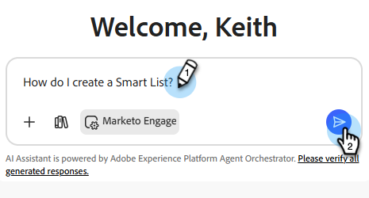

# 产品知识AI助手 {#ai-assistant-for-product-knowledge}

用于产品知识的AI Assistant是适用于营销团队的强大加速器，可即时提供对Marketo Engage产品文档的全部宽度和深度的对话访问。 它通过适时显示准确的最新产品详细信息而简化了营销活动创建、内容开发和用户消息传送过程。

借助产品知识AI助手，您的团队可以更快地移动，更有效地协作，并提供简洁、准确和有效的营销。

## 使用助手 {#use-the-assistant}

1. 通过[Adobe Experience Cloud](https://experience.adobe.com/)登录Marketo Engage。

1. 选择标题右侧的AI助手图标。

   

1. 使用自然语言输入所需的提示。

   

1. 单击蓝色箭头提交提示。

   

   >[!TIP]
   >
   >使用此图标展开屏幕，使用此图标查看历史记录或开始新对话。

## 快速入门：60秒视频概述 {#video}

>[!VIDEO](https://video.tv.adobe.com/v/3480115?learn=on){transcript=true}
