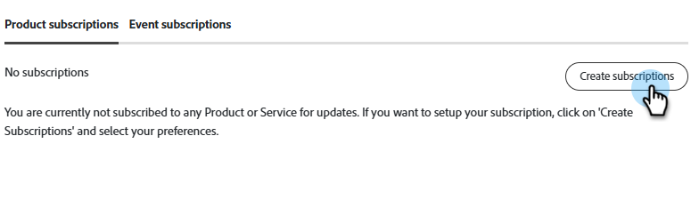

# 订阅系统状态通知 {#subscribe-to-system-status-notifications}

介绍文本

>[!PREREQUISITES]
>
>在创建订阅之前，您必须首先确定订阅所在的数据中心和面板/服务器。

## 识别您的数据中心 {#identify}

+++识别您的数据中心和面板/服务器

1. 在Marketo Engage的&#x200B;**管理员**&#x200B;部分中，单击&#x200B;**我的帐户**。

   

1. 向下滚动至&#x200B;_支持信息_。

   

在&#x200B;_数据中心_&#x200B;字段中，字母是数据中心，数字是面板。 在上面的示例中，用户位于位于舱49上的Ashburn数据中心。

在[创建订阅](#create-a-subscription)的步骤7中，此用户将选择区域位置&#x200B;**Marketo Ashburn**&#x200B;和面板&#x200B;**ab49**。

<table style="width:225px;">
  <tr>
    <th colspan="2">数据中心缩写</th>
  </tr>
  <tr>
    <td style="width:25%;">ab</td>
    <td>Ashburn</td>
  </tr>
  <tr>
    <td style="width:25%;">sj</td>
    <td>圣何塞</td>
  </tr>
  <tr>
    <td style="width:25%;">sn</td>
    <td>悉尼</td>
  </tr>
  <tr>
    <td style="width:25%;">lon</td>
    <td>伦敦</td>
  </tr>
  <tr>
    <td style="width:25%;">nld</td>
    <td>阿姆斯特丹</td>
  </tr>
</table>

>[!TIP]
>
>此方法还可用于识别您的订阅使用的实时Personalization (RTP)面板/服务器。

+++

## 创建订阅 {#create-a-subscription}

在[识别您的数据中心和pod/server](#identify)后，请按照以下步骤创建订阅。

1. 在[status.adobe.com](https://status.adobe.com)上，单击&#x200B;**管理订阅**。

   

1. 使用您的Adobe凭据登录（如果尚未登录），或者单击&#x200B;**创建帐户**（如果没有）。

   

1. 停留在&#x200B;_产品描述_&#x200B;选项卡中，然后单击&#x200B;**创建订阅**。

   

1. 单击旁边的&#x200B;_加号图标_&#x200B;图标展开菜单。 对&#x200B;_Adobe Marketo Engage_&#x200B;执行相同操作。

   

1. 选择要接收有关通知的所需产品/服务，然后单击&#x200B;**继续**。

   >[!TIP]
   >
   >选中&#x200B;_Adobe Marketo Engage_&#x200B;以选择全部。

   

1. 选择所需的事件类型。

   

   <table style="width:600px;">
   <tr>
   <td style="width:30%;"><b>重大服务问题</b></td>
   <td>生产系统上多个用户的服务不可用或性能严重下降。</td>
   </tr>
   <tr>
   <td style="width:30%;"><b>轻微服务问题</b></td>
   <td>生产系统上的多个用户出现部分服务不可用或性能适度下降。</td>
   </tr>
   <tr>
   <td style="width:30%;"><b>服务维护</b></td>
   <td>文本</td>
   </tr>
   <tr>
   <td style="width:30%;"><b>公告</b></td>
   <td>与……相关的公告</td>
   </tr>
   </table>

1. 选择所需的区域位置和环境。 单击&#x200B;**继续**。

   

1. 选择您的订阅首选项&#x200B;**电子邮件**&#x200B;或&#x200B;**Slack**，然后单击&#x200B;**继续**。

   

1. 查看您的选择，然后单击&#x200B;**确认首选项**。

   
