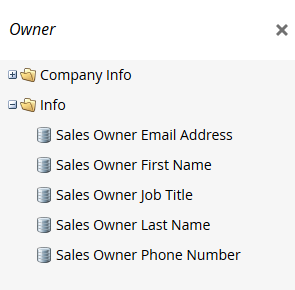

# Marketo术语更新 {#updates-to-marketo-terminology}

我们正在对平台进行一些更改，这将影响一些所谓的内容。 如果您自2016年3月起有新的Marketo实例，或者如果您的公司在2016年7月后续订，则现在可能会看到新术语。

虽然您可能会在Marketo文档中看到不同的术语，但请确保每篇文章都会很快更新，以反映这些更改。 所有说明都相同。

那么，有什么变化？

## “潜在客户”现在为“人员” {#lead-is-now-person}

最大的变化是将潜在客户/潜在客户重命名为“人员/人员”。

<table> 
 <colgroup> 
  <col> 
  <col> 
 </colgroup> 
 <tbody> 
  <tr> 
   <td><strong>旧</strong></td> 
   <td><strong>新</strong></td> 
  </tr> 
  <tr> 
   <td> 
    
 
      
    
</td> 
   <td> 
    
 
      
    
</td> 
  </tr> 
 </tbody> 
</table>

在某些情况下，“Lead”一词被简单地删除。

<table> 
 <colgroup> 
  <col> 
  <col> 
 </colgroup> 
 <tbody> 
  <tr> 
   <td><strong>旧</strong></td> 
   <td><strong>新</strong></td> 
  </tr> 
  <tr> 
   <td> 
    
 
      
    
</td> 
   <td> 
    
 
     

 
    
</td> 
  </tr> 
 </tbody> 
</table>

潜在客户和人员 **是一样的**.

## 令牌 {#tokens}

带前导字的令牌 **未更改**. 我们为任何混乱表示歉意；但是，如果更改所有令牌以匹配新术语，则会损坏当前使用的整个令牌。 因此，您仍会看到令牌，例如“`{{lead.First Name}}`.&quot; 没有特定于人员的令牌。

>[!NOTE]
>
>那里 *is* 名为“人员备注”的令牌，但该令牌始终存在。 它通常用于CRM中的描述字段（如果根本不用）。

## 字段管理 {#field-management}

包含术语“Lead”的字段已被“Person”替换，或“Lead”一词已被删除。 但“潜在客户所有者”字段是一个值得注意的例外。 它现在称为“销售所有者”。

<table> 
 <colgroup> 
  <col> 
  <col> 
 </colgroup> 
 <tbody> 
  <tr> 
   <td><strong>旧</strong></td> 
   <td><strong>新</strong></td> 
  </tr> 
  <tr> 
   <td> 
    
 
      
    
</td> 
   <td> 
    
 
      
    
</td> 
  </tr> 
 </tbody> 
</table>

>[!NOTE]
>
>有关受影响的字段名称的完整列表，请访问此 [支持文章](https://nation.marketo.com/docs/DOC-4218#jive_content_id_Field_Names_and_Tokens){target=&quot;_blank&quot;}。

## 实时个性化(RTP)现在是Web个性化 {#real-time-personalization-rtp-is-now-web-personalization}

<table> 
 <colgroup> 
  <col> 
  <col> 
 </colgroup> 
 <tbody> 
  <tr> 
   <td><strong>旧</strong></td> 
   <td><strong>新</strong></td> 
  </tr> 
  <tr> 
   <td> 
    
 
      
    
</td> 
   <td> 
    
 
      
    
</td> 
  </tr> 
 </tbody> 
</table>

除了名称更改之外，它现在还包含四个单独的应用程序：

| **[Web个性化](https://docs.marketo.com/display/DOCS/Web+Personalization+-+RTP){target=&quot;_blank&quot;}** | 在主屏幕上有自己的图块 |
|---|---|
| **[基于帐户的Web营销](https://docs.marketo.com/display/DOCS/Account-Based+Web+Marketing){target=&quot;_blank&quot;}** | 可通过Web个性化拼贴访问 |
| **[个性化重定位](https://docs.marketo.com/display/DOCS/Website+Retargeting){target=&quot;_blank&quot;}** | 可通过Web个性化拼贴访问 |
| **[预测内容](https://docs.marketo.com/display/DOCS/Predictive+Content){target=&quot;_blank&quot;}** | 在主屏幕上有自己的图块 |

>[!NOTE]
>
>主屏幕上显示的图块将反映已购买的模块。

感谢您在此更新期间的耐心等待。
