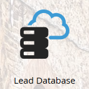

# Marketo 术语更新 {#updates-to-marketo-terminology}

我们正在对平台进行一些更改，这将影响部分功能或项目的称呼方式。如果您在 2016 年 3 月之后启用了新的 Marketo 实例，或您的公司在 2016 年 7 月之后完成续订，那么您现在可能已经看到新的术语。

虽然您可能会在 Marketo 文档中看到不同的术语，但请放心，所有文章都会尽快更新以反映这些变化。所有操作说明保持不变。

那么，具体有哪些变化？

## “潜在客户”（Lead）现已更名为“人员”（Person） {#lead-is-now-person}

最大的变化是将“潜在客户”（Lead/Leads）重命名为“人员”（Person/People）。

<table>
 <colgroup>
  <col>
  <col>
 </colgroup>
 <tbody>
  <tr>
   <td><strong>旧的名称</strong></td>
   <td><strong>新的名称</strong></td>
  </tr>
  <tr>
   <td>
    

     
    
</td>
   <td>
    

     
    
</td>
  </tr>
 </tbody>
</table>

在某些情况下，“潜在客户”（Lead）一词将被直接移除。

<table>
 <colgroup>
  <col>
  <col>
 </colgroup>
 <tbody>
  <tr>
   <td><strong>旧的名称</strong></td>
   <td><strong>新的名称</strong></td>
  </tr>
  <tr>
   <td>
    

     
    
</td>
   <td>
    

     

    
</td>
  </tr>
 </tbody>
</table>

“潜在客户”（Lead）与“人员”（Person）**表示相同的概念**。

## 令牌 {#tokens}

包含“潜在客户”（Lead）一词的令牌&#x200B;**不会更改**。对于由此造成的混淆，我们深表歉意；但如果将所有令牌更改为新术语，将会导致大量正在使用的令牌失效。因此，您仍会看到类似“`{{lead.First Name}}`”的令牌。没有特定于“人员”（Person）的令牌。

>[!NOTE]
>
>*有一个*&#x200B;名为“Person Notes”的令牌，但该令牌一直都存在。它通常用于 CRM 中的描述字段（如果使用的话）。

## 字段管理 {#field-management}

包含“潜在客户”（Lead）的字段已被替换为“人员”（Person），或直接移除了“潜在客户”（Lead）一词。但一个显著的例外是“潜在客户所有者”（Lead Owner）字段。它现在被称为“销售所有者”（Sales Owner）。

<table>
 <colgroup>
  <col>
  <col>
 </colgroup>
 <tbody>
  <tr>
   <td><strong>旧的名称</strong></td>
   <td><strong>新的名称</strong></td>
  </tr>
  <tr>
   <td>
    

     
    
</td>
   <td>
    

     
    
</td>
  </tr>
 </tbody>
</table>

>[!NOTE]
>
>有关受影响字段名称的完整列表，请访问此[支持文章](https://nation.marketo.com/docs/DOC-4218#jive_content_id_Field_Names_and_Tokens){target="_blank"}。

## 实时个性化（RTP）现已更名为 Web 个性化（Web Personalization） {#real-time-personalization-rtp-is-now-web-personalization}

<table>
 <colgroup>
  <col>
  <col>
 </colgroup>
 <tbody>
  <tr>
   <td><strong>旧的名称</strong></td>
   <td><strong>新的名称</strong></td>
  </tr>
  <tr>
   <td>
    

     
    
</td>
   <td>
    

     
    
</td>
  </tr>
 </tbody>
</table>

除了更名外，它现在由四个独立的应用程序组成：

| **[Web 个性化](https://docs.marketo.com/display/DOCS/Web+Personalization+-+RTP){target="_blank"}** | 在主屏幕上有独立模块 |
|---|---|
| **[基于账户的 Web 营销](https://docs.marketo.com/display/DOCS/Account-Based+Web+Marketing){target="_blank"}** | 可通过 Web 个性化模块访问 |
| **[个性化重定向](https://docs.marketo.com/display/DOCS/Website+Retargeting){target="_blank"}** | 可通过 Web 个性化模块访问 |
| **[预测性内容](https://docs.marketo.com/display/DOCS/Predictive+Content){target="_blank"}** | 在主屏幕上有独立模块 |

>[!NOTE]
>
>主屏幕上显示的模块取决于您购买的功能模块。

感谢您在本次更新过程中的耐心等待。
