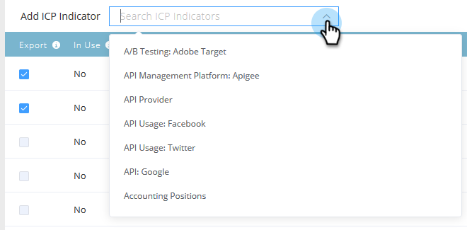

# 帐户分析排名和调整 {#account-profiling-ranking-and-tuning}

“帐户分析”可确定您的理想客户用户档案(ICP)，根据ICP对数据库中的公司进行排名，并将ICP指标数据添加到作为指定帐户提升的帐户。

## 模型结果 {#model-results}

结果显示您按等级划分的所有已知帐户。 A是最高等级，D是最低。

虽然可选，但我们建议选中“自动提升”复选框，因为这将为您节省大量时间。 但是，如果您要浏览每个帐户并手动添 [加它们](http://docs.marketo.com/display/DOCS/Discover+Accounts#DiscoverAccounts-DiscoverCRMAccounts)，只需取消选中该框。

<table> 
 <tbody> 
  <tr> 
   <td><strong>排名</strong></td> 
   <td> 
    

      帐户排名基于理想客户用户档案。 A是最合适的，D是最不适合的。 
    
</td> 
  </tr> 
  <tr> 
   <td><strong>倾向</strong></td> 
   <td> 
    

      与非基于比较方案的账户选择相比，转化率估计增加。 
    
</td> 
  </tr> 
  <tr> 
   <td><strong>帐户(%)</strong></td> 
   <td> 
    

      具有此排名的模型输入中帐户的百分比。 
    
</td> 
  </tr> 
  <tr> 
   <td><strong>模型基础的%</strong></td> 
   <td> 
    

      模型基础中具有此排名的帐户百分比。 
    
</td> 
  </tr> 
 </tbody> 
</table>

## 模型调整 {#model-tuning}

在“模型”(Model)选项卡中，单击“调整模型”(Tune Model)按钮。

有多个选项卡可供选择，允许深入自定义。

指标类别

| **法规遵从性** | 认证、合规相关职位／招聘。 |
|---|---|
| **操作** | 与运营相关的职位／聘用。 |
| **HR** | HR或工资单软件，与HR相关的职位／聘用。 |
| **工程** | 技术、框架、工程相关职位／聘用。 |
| **销售** | 用于销售、销售相关职位／招聘的解决方案和软件。 |
| **用途** | 意图指示器。 |
| **IT** | 硬件和软件解决方案、技术、IT相关职位／招聘。 |
| **金融** | 财务软件、财务相关职位／聘用。 |
| **营销** | 营销技术和软件、与营销相关的职位／聘用。 |
| **商业** | 福布斯或Inc上市或建立商业伙伴关系。 |
| **客户体验与关系** | 客户成功和客户关系职位／聘用。 |

将鼠标悬停在工具提示上，可获得每列的说明。

单击“Add ICP Indicator（添加ICP指示器）”下拉框，将其他指示器插入模型。

选中“导出”框允许您在“指定帐户详细信息”页上查看ICP指示符，并将所选ICP指示符用作指定帐户过滤器 [中的约束](http://docs.marketo.com/display/DOCS/Account+Filters)。

>[!NOTE]
>
>ICP指标作为约束包含在指定 **帐户过滤器和触发器** 的成员中。

指示器权重是控制模型中每个指示器接收的重要程度的指标。

单击“刷新模型”(Refresh Model)以使这些更改生效。

模型调整完毕（刷新模型后）后，返回“模型结果”(Model Results)选项卡，单击“保 **存并应用排名”(Save &amp; Apply Raws**)。

