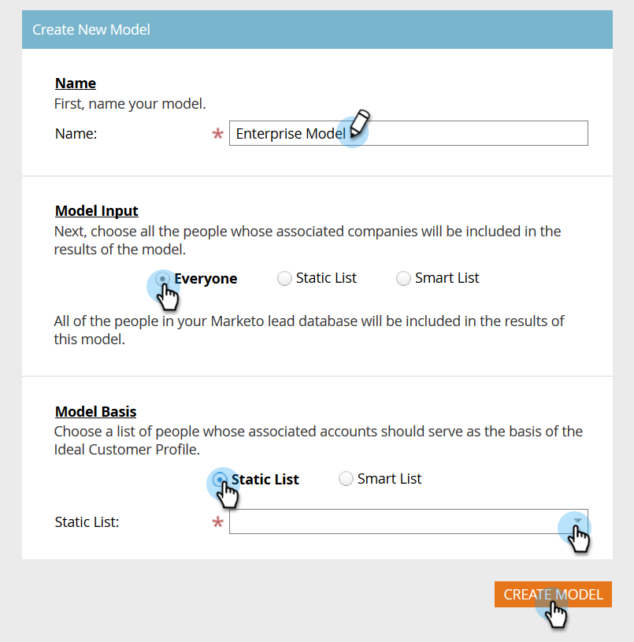

# 设置帐户分析 {#setting-up-account-profiling}

请按照以下步骤使用帐户分析进行开始。

1. 在我的市场中，基于 **帐户的开放营销**。

   

1. 单击“帐户分析”选项卡。

   

1. “模型”(Model)选项卡默认处于打开状态。 单击 **开始**。

   

1. 为您的模型命名，选择结果中包含的对象，以及作为理想客户用户档案(ICP)基础的对象。 完成 **后，单击** “创建模型”(Create Model)。

   

1. 模型将开始构建。 可能需要一段时间，但不用担心，完成后会通知您。

   

1. 要查看模型的结果，请单击“查看模 **型结果”(See Model Result**)。

   

   您的模型现已创建。

   

   >[!TIP]
   >
   >现在，您已创建了模型，在“帐户分析概述”中了 [解如何调整它](http://docs.marketo.com/x/NIDv)。

