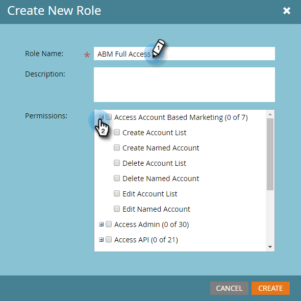

# 权限{#permissions}

您需要为用户设置使用ABM的权限。 这是方法。

1. 单击&#x200B;**管理员**。

   

1. 单击&#x200B;**用户和角色**。

   

   >[!NOTE]
   >
   >您可以为现有角色添加ABM权限，或创建全新角色。 此示例使用新角色。

1. 单击&#x200B;**角色**，然后单击&#x200B;**新角色**。

   

1. 输入角色名称，然后单击“基于访问帐户的营销”复选框旁边的&#x200B;**+**&#x200B;图标。

   

1. 要选择&#x200B;_所有_&#x200B;权限，只需选中&#x200B;**基于访问帐户的营销**&#x200B;复选框。

   

   >[!NOTE]
   >
   >您还可以选择仅选择部分选项。 单独选中每个复选框即可实现此操作。

1. 单击&#x200B;**+**&#x200B;以打开“访问管理员”菜单。 选中&#x200B;**访问ABM管理员**&#x200B;复选框。

   

   您的新ABM角色现在可以分配给用户](/help/marketo/product-docs/administration/users-and-roles/managing-user-roles-and-permissions.md#assign-roles-to-a-user)[!

   
