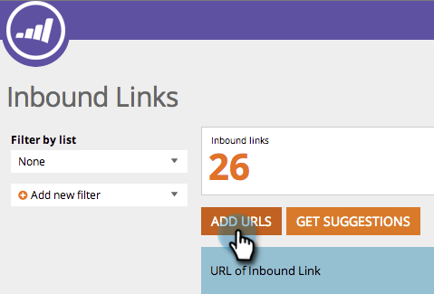

# SEO - 手动添加入站链接 URL {#seo-add-an-inbound-link-url-manually}

您可以手动添加入站链接。 操作方法如下：

>[!IMPORTANT]
>
>2026年3月31日，Marketo Engage将弃用搜索引擎优化功能。 请在3月30日或之前导出任何相关数据。 [了解详情](https://nation.marketo.com/t5/product-blogs/marketo-engage-seo-feature-deprecation/ba-p/359060){target="_blank"}。
>
>* [导出问题](https://experienceleague.adobe.com/zh-hans/docs/marketo/using/product-docs/additional-apps/seo/pages/seo-export-issues-to-csv){target="_blank"}
>* [导出关键字结果](https://experienceleague.adobe.com/zh-hans/docs/marketo/using/product-docs/additional-apps/seo/keywords/seo-exporting-keyword-results){target="_blank"}
>* [导出关键词趋势](https://experienceleague.adobe.com/zh-hans/docs/marketo/using/product-docs/additional-apps/seo/reports/seo-use-the-keyword-trends-report#exporting-data){target="_blank"}
>* [导出竞争者关键词趋势](https://experienceleague.adobe.com/zh-hans/docs/marketo/using/product-docs/additional-apps/seo/reports/seo-use-the-competitor-kw-trends-report#exporting-data){target="_blank"}

1. 转到&#x200B;**[!UICONTROL Inbound Links]**&#x200B;部分。

   

1. 单击 **[!UICONTROL Add URLs]**。

   

1. 键入URL。 单击 **[!UICONTROL Add]**。

   

   >[!TIP]
   >
   >您是否知道您可以[将入站链接添加到新的或现有的列表](/help/marketo/product-docs/additional-apps/seo/understanding-seo/seo-managing-lists.md){target="_blank"}？ 看啊！

   

摇滚起来！ 现在，您应该会看到新的URL已添加到列表中。 收集所有数据可能需要一些时间。
