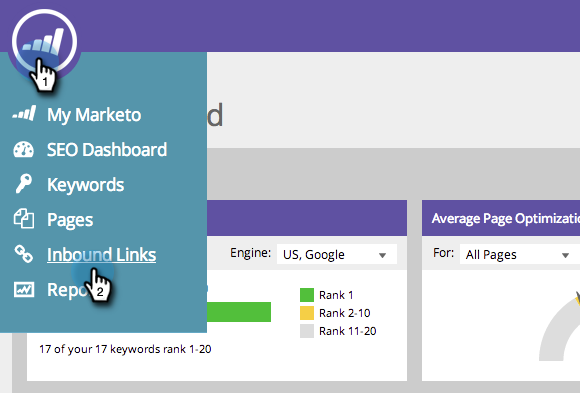

# SEO — 从列表添加/删除入站链接URL {#seo-add-remove-an-inbound-link-url-from-a-list}

您可以组织指向您心中内容的入站链接URL。

## 向列表添加入站链接URL {#add-an-inbound-link-url-to-a-list}

1. 转到Inbound Links部分。

   

1. 将鼠标悬停在要分类的集客链接URL上。 单击 **从列表添加/删除**.

   

1. 单击您希望集客链接URL转到的列表。

   

>[!TIP]
>
>您还可以为要转到的关键词创建一个新列表。 只需在创建新列表中键入所需的名称即可。

## 从列表中删除入站链接URL {#remove-an-inbound-link-url-from-a-list}

有时，您会希望从列表中删除集客链接URL。

1. 单击 **入站链接**.

   

1. 单击 **按列表筛选** 下拉菜单。 单击要清理的列表。

   

1. 将鼠标悬停在要删除的集客链接URL上。 单击 **从列表添加/删除**.

   

1. 您要组织的列表将被选中。 单击列表名称，以从此列表中删除集客链接URL。

   

你成功了！ 刷新页面以更新显示内容。
