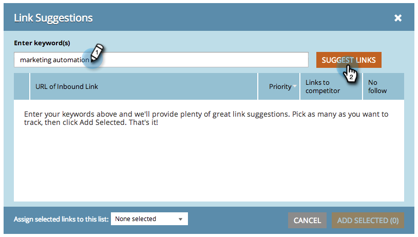

# SEO — 获取入站链接建议 {#seo-get-inbound-link-suggestions}

Marketo可以建议哪些入站链接对您的 [离页优化](/help/marketo/product-docs/additional-apps/seo/understanding-seo/understanding-search-engine-optimization.md).

1. 转到 **入站链接** 中。

   

1. 单击 **获取建议**.

   

1. 输入关键词。 单击 **建议链接**.

   

1. 选择链接。 单击 **添加选定项**.

   

   >[!TIP]
   >
   >你知道你能  [将链接添加到新列表或现有列表](/help/marketo/product-docs/additional-apps/seo/inbound-links/seo-add-remove-an-inbound-link-url-from-a-list.md)? 看看！

1. 太棒了！ 现在将跟踪这些添加的链接。

   >[!NOTE]
   >
   >[了解入站链接](/help/marketo/product-docs/additional-apps/seo/inbound-links/seo-understanding-inbound-links.md)
