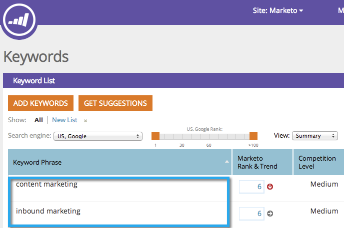

# SEO — 添加关键词 {#seo-add-keywords}

关键词是指用户在搜索引擎中键入的短语。 添加与您的业务最相关的关键词。

>[!NOTE]
>
>如果您有许多关键词，则可以 [使用CSV文件导入它们](/help/marketo/product-docs/additional-apps/seo/keywords/seo-importing-keywords-with-a-csv.md).

1. 转到 **关键词** 中。

   

1. 输入要定位的关键词并单击 **保存**.

   

   >[!TIP]
   >
   >使用换行符或逗号分隔关键词。

   

   >[!MORELIKETHIS]
   >
   >[了解关键词（摘要视图）](/help/marketo/product-docs/additional-apps/seo/keywords/seo-understanding-keywords.md)

干得好！ 此时您应会看到关键词列表的新增内容。
