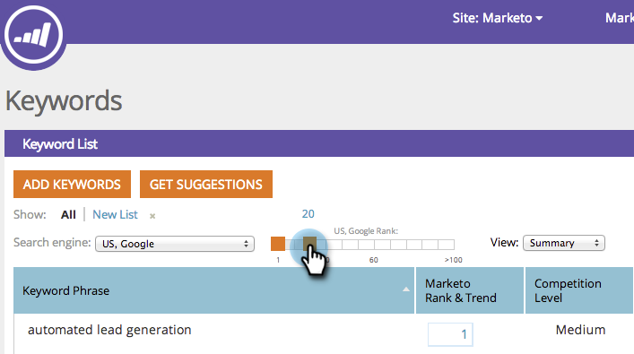

# SEO — 筛选关键字结果{#seo-filter-keyword-results}

您可能有许多[关键字](/help/marketo/product-docs/additional-apps/seo/keywords/seo-understanding-keywords.md)。 以下是筛选它们的不同方法：

## 按列表{#filter-by-list}过滤

1. 转到&#x200B;**关键字**&#x200B;部分。

   

1. 单击您所关注列表的名称。

   

   >[!NOTE]
   >
   >如果看不到任何列表,[将学习如何生成关键字列表](/help/marketo/product-docs/additional-apps/seo/understanding-seo/seo-managing-lists.md)。

真贴心！ 您现在只查看该列表上的关键字。

## 按SERP排名{#filter-by-serp-rank}筛选

1. 转到“关键字”部分。

   

   橙色正方形定义了上限（左）和下限（右）。 过滤器对关键字的[SERP排名](/help/marketo/product-docs/additional-apps/seo/understanding-seo/understanding-search-engine-optimization.md)起作用。

1. 左/右滑动橙色方块以筛选结果。

   

## 按搜索筛选{#filter-by-search}

您还可以使用右上角的搜索字段查找要查找的关键字。

1. 转到&#x200B;**关键字**&#x200B;部分。

   

1. 在搜索字段中输入关键字。

   
