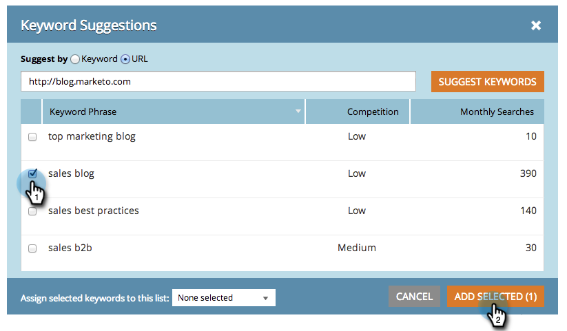

# SEO —— 获取建议的关键字{#seo-get-suggested-keywords}

Marketo SEO可以建议您应跟踪哪些关键字。 我们可以根据关键字或站点的URL提供建议。 试试看！

## 使用关键字{#get-keyword-suggestions-using-a-keyword}获取关键字建议

1. 转到&#x200B;**关键字**&#x200B;部分。

   

1. 单击&#x200B;**GET建议**。

   

1. 输入&#x200B;**关键字**。 单击&#x200B;**建议关键字**。

   

   >[!TIP]
   >
   >您知道可以[在此处将关键字添加到新列表或现有的关键字](../../../../product-docs/additional-apps/seo/understanding-seo/seo-managing-lists.md)吗？

1. 选择建议的关键字。 单击&#x200B;**添加选定项**。

   

   太好了！ 您的关键字已添加。

   

   耶厄哈！ 现在，您已了解如何根据关键字获取关键字建议，请尝试根据URL获取建议。

## 从URL{#get-keyword-suggestions-from-a-url}获取关键字建议

1. 转到&#x200B;**关键字**&#x200B;部分。

   

1. 单击&#x200B;**GET建议**。

   

1. 将&#x200B;**建议方式**&#x200B;设置为&#x200B;**URL**。

   

1. 输入&#x200B;**URL**&#x200B;并单击&#x200B;**建议关键字**。

   

   >[!TIP]
   >
   >您知道可以[在此处将关键字添加到新列表或现有的关键字](../../../../product-docs/additional-apps/seo/understanding-seo/seo-managing-lists.md)吗？

1. 选择建议的关键字。 单击&#x200B;**添加选定项**。

   

1. 太好了！ 您的关键字已添加。

   

   好吧，你在摇这东西。 继续！

   >[!NOTE]
   >
   >**相关文章**
   >
   >    
   >    
   >    * [了解关键字(摘要视图)](seo-understanding-keywords.md)
   >    * [从列表添加／删除关键字](seo-add-remove-keywords-from-a-list.md)

