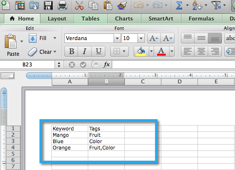

# SEO — 使用CSV导入关键字 {#seo-importing-keywords-with-a-csv}

1. 您可以 [添加关键字](/help/marketo/product-docs/additional-apps/seo/keywords/seo-add-keywords.md) 手动， [获取关键词建议](/help/marketo/product-docs/additional-apps/seo/keywords/seo-get-suggested-keywords.md) 甚至可以从CSV文件导入关键字。 下面是如何导入的。

1. 转到 **[!UICONTROL 关键字]** 部分。

   

1. 单击 **[!UICONTROL 导入]**.

   

1. 选择要导入的Excel文件。

   

1. 单击 **[!UICONTROL 选择文件]**.

   

   >[!NOTE]
   >
   >导入限制因您的订阅而异。 有关更多信息，请与您的销售代表联系。

1. 单击 **[!UICONTROL 导入]**.

   

   您应会看到新关键字按字母顺序显示在关键字列表中。

   

   >[!NOTE]
   >
   >加载与每个关键词关联的所有数据可能需要几分钟时间。

   >[!MORELIKETHIS]
   >
   >* [了解关键字（摘要视图）](/help/marketo/product-docs/additional-apps/seo/keywords/seo-understanding-keywords.md)
   >* [在列表中添加/删除关键字](/help/marketo/product-docs/additional-apps/seo/keywords/seo-add-remove-keywords-from-a-list.md)
