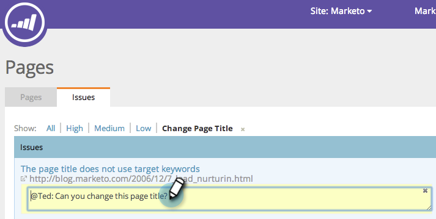
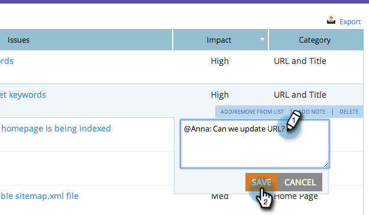

# SEO — 向页面问题添加注释 {#seo-add-notes-to-page-issues}

您是否知道可以将备注作为个人提醒或团队消息添加到页面问题？

## 在页面问题部分添加注释 {#adding-notes-in-page-issues-section}

1. 转到 **[!UICONTROL 页面]** 部分。

   

1. 在页面选项卡上，单击 **[!UICONTROL 问题]**.

   

1. 将鼠标悬停在要向其添加注释的问题上。 单击 **[!UICONTROL 添加便笺]**.

   

1. 在黄色文本框中输入注释。 单击文本框外部将保存注释。

>[!TIP]
>
>您可以通过单击小的 **x** 左上角。

## 在页面详细信息向下钻取中添加注释 {#add-notes-in-page-detail-drill-down}

1. 转到 **[!UICONTROL 页面]** 部分。

   

1. 单击要查看其详细信息的页面。

   

1. 将鼠标悬停在要向其添加注释的页面问题上，然后单击 **[!UICONTROL 添加注释]**.

   

1. 输入注释。 单击 **[!UICONTROL 保存]**.

   

   已添加您的注释！

   
