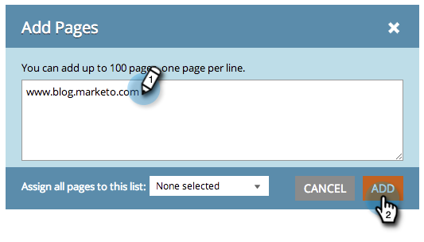

# SEO — 添加页面 {#seo-add-pages}

你有页！ Marketo SEO将自动爬网并跟踪您的网站。 如果漏掉了一些，请在SEO应用程序中以如下方式获取它们：

1. 转到 **页面** 中。

   

1. 单击 **添加页面**.

   

1. 键入要添加的URL。 单击 **添加**.

   

   >[!TIP]
   >
   >你知道你能 [将页面添加到新列表或现有列表](/help/marketo/product-docs/additional-apps/seo/understanding-seo/seo-managing-lists.md)? 看看！

   页面数据可能需要一些时间才能加载。 等待绿色警报消息并刷新页面以更新显示内容。

   

   您现在可以跟踪此页面在搜索中的执行情况。
