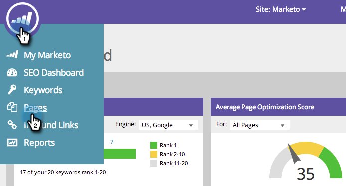

# SEO — 在列表中添加/删除页面 {#seo-add-remove-page-from-list}

是否要管理您的页面？ 您可以通过创建列表轻松实现这一点。 您可以使用列表来组织页面或在功能板中筛选数据。

## 将页面添加到列表 {#add-page-to-a-list}

1. 转到 **[!UICONTROL 页面]** 部分。

   

1. 将鼠标悬停在要添加到列表的页面上。 单击 **[!UICONTROL 在列表中添加/删除]**.

   

1. 单击要将页面添加到的列表。

   

   >[!TIP]
   >
   >您还可以为页面创建一个新列表以供转到。 只需在中键入所需的名称 [!UICONTROL 创建新列表].

1. 单击您刚刚将页面添加到的列表。

   

耶！ 此时，您应该会看到您的页面已添加到列表中。

## 从列表中删除页面 {#remove-page-from-a-list}

1. 转到 **[!UICONTROL 页面]** 部分。

   

1. 在 **[!UICONTROL 页面]** 选项卡，单击要清理的列表。

   

1. 将鼠标悬停在要删除的页面上。 单击 **[!UICONTROL 在列表中添加/删除]**.

   

1. 单击要从列表中将其删除的列表。

   >[!NOTE]
   >
   >该关键字当前所属的所有列表都将具有复选标记。 从列表中删除后，该复选框将消失。

   

完成. 您的页面将从列表中删除。
