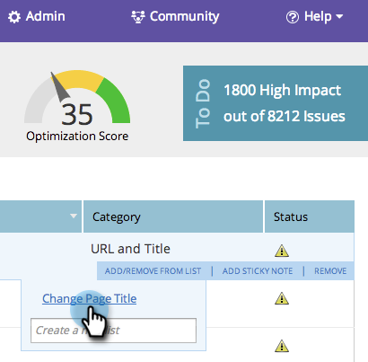

# SEO — 在列表中添加/删除页面问题 {#seo-add-remove-page-issue-from-a-list}

您可以将页面问题整理到列表中。 您还可以从列表中删除页面问题。

## 将页面问题添加到列表 {#add-page-issues-to-a-list}

1. 转到 **[!UICONTROL 页面]** 部分。

   

1. 在 **[!UICONTROL 页面]** 选项卡，单击 **[!UICONTROL 问题]**.

   

1. 将鼠标悬停在要添加的“页面问题”上。 单击 **[!UICONTROL 在列表中添加/删除]**.

   

   单击要将页面问题添加到的列表。

   

   >[!TIP]
   >
   >您还可以为要转移的关键字创建一个新列表。 只需在中键入所需的名称 **[!UICONTROL 创建新列表]**.

## 从列表中删除页面问题 {#remove-page-issue-from-a-list}

1. 转到 **[!UICONTROL 页面]** 部分。

   

1. 在页面选项卡上，单击 **[!UICONTROL 问题]**.

   

1. 单击要整理的列表。

   

1. 将鼠标悬停在要删除的页面问题上。 单击 **[!UICONTROL 在列表中添加/删除]**.

   

1. 应检查要整理的列表。 单击列表名称可从此列表中删除页面问题。

   

太棒了！ 刷新页面，您将不会再在列表中看到它。
