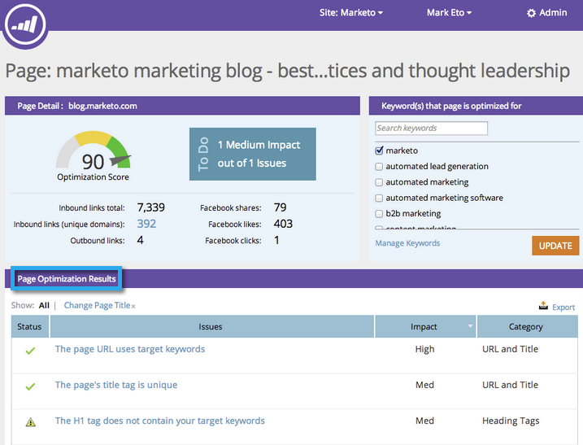

# SEO - 将问题导出为 CSV {#seo-export-issues-to-csv}

如果要与Marketo外部的人员共享该信息，您可以将[页面问题](/help/marketo/product-docs/additional-apps/seo/pages/seo-understanding-pages.md)数据导出到CSV文件。 操作方法如下：

>[!IMPORTANT]
>
>2026年3月31日，Marketo Engage [弃用搜索引擎优化](https://nation.marketo.com/t5/product-blogs/marketo-engage-seo-feature-deprecation/ba-p/359060){target="_blank"}功能。 [seo.marketo.com](https://seo.marketo.com/)在有限的时间内仍然可用。 按照以下文章中的步骤导出任何数据。
>
>* [导出问题](https://experienceleague.adobe.com/zh-hans/docs/marketo/using/product-docs/additional-apps/seo/pages/seo-export-issues-to-csv){target="_blank"}
>* [导出关键字结果](https://experienceleague.adobe.com/zh-hans/docs/marketo/using/product-docs/additional-apps/seo/keywords/seo-exporting-keyword-results){target="_blank"}
>* [导出关键词趋势](https://experienceleague.adobe.com/zh-hans/docs/marketo/using/product-docs/additional-apps/seo/reports/seo-use-the-keyword-trends-report#exporting-data){target="_blank"}
>* [导出竞争者关键词趋势](https://experienceleague.adobe.com/zh-hans/docs/marketo/using/product-docs/additional-apps/seo/reports/seo-use-the-competitor-kw-trends-report#exporting-data){target="_blank"}

1. 转到&#x200B;**[!UICONTROL Pages]**&#x200B;部分。

   

1. 单击要查看其详细信息的页面。

   

   这是[页面详细信息深入分析](/help/marketo/product-docs/additional-apps/seo/pages/seo-using-the-page-detail-drill-down.md)。 **[!UICONTROL Page Optimization Results]**&#x200B;是该特定页面所有问题的列表。

   

1. 单击 **[!UICONTROL Export]**。

   
