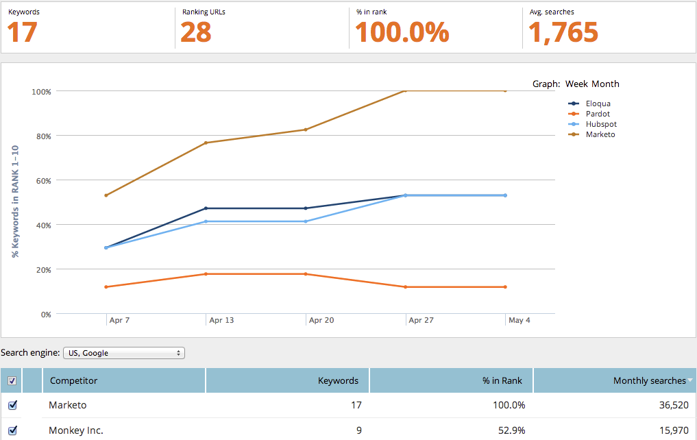

# SEO — 使用“竞争对手KW趋势”报表 {#seo-use-the-competitor-kw-trends-report}

在此报表中，您可以看到您和您的竞争对手在一段时间内按关键字排名的方式。

## 查找报表 {#find-reports}

1. 转到 **[!UICONTROL 报表]**.

   

1. 单击 **[!UICONTROL 竞争者KW排名趋势]**.

   

## KW排名趋势图 {#kw-rank-trends-graph}

此图表可以显示在指定范围内排名的关键字的百分比，以及您的竞争对手的栈叠方式。

| 项目 | 描述 |
|---|---|
| [!UICONTROL 关键字] | 您正在跟踪的关键字数。 |
| [!UICONTROL 排名URL] | 网站排名在您设置的范围中的URL数。 |
| [!UICONTROL 排名中的%] | 在设置的范围中排名的关键字的百分比。 |
| [!UICONTROL 平均 搜索] | 在您设置的搜索范围内(过去30天内，在Google美国搜索中)对这些关键字的平均搜索次数 |

## 筛选数据 {#filtering-data}

1. 单击下拉列表，然后选择所需的时段。

   

1. 单击 **[!UICONTROL 排名]** 下拉列表以选择要查看关键字的排名范围。

   

## 导出数据 {#exporting-data}

>[!TIP]
>
>您可以将此报告导出到桌面。

1. 单击 **[!UICONTROL 导出CSV]** 或 **[!UICONTROL Export PDF]**.

   
