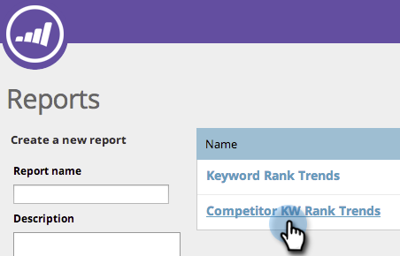
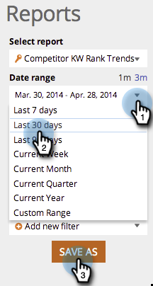

# SEO - 使用竞争对手关键词趋势报告 {#seo-use-the-competitor-kw-trends-report}

在此报表中，查看您和您的竞争对手在一段时间内如何按关键字排名。

>[!IMPORTANT]
>
>2026年3月31日，Marketo Engage [弃用搜索引擎优化](https://nation.marketo.com/t5/product-blogs/marketo-engage-seo-feature-deprecation/ba-p/359060){target="_blank"}功能。 [seo.marketo.com](https://seo.marketo.com/)在有限的时间内仍然可用。 按照以下文章中的步骤导出任何数据。
>
>* [导出问题](https://experienceleague.adobe.com/en/docs/marketo/using/product-docs/additional-apps/seo/pages/seo-export-issues-to-csv){target="_blank"}
>* [导出关键字结果](https://experienceleague.adobe.com/en/docs/marketo/using/product-docs/additional-apps/seo/keywords/seo-exporting-keyword-results){target="_blank"}
>* [导出关键词趋势](https://experienceleague.adobe.com/en/docs/marketo/using/product-docs/additional-apps/seo/reports/seo-use-the-keyword-trends-report#exporting-data){target="_blank"}
>* [导出竞争者关键词趋势](https://experienceleague.adobe.com/en/docs/marketo/using/product-docs/additional-apps/seo/reports/seo-use-the-competitor-kw-trends-report#exporting-data){target="_blank"}

## 查找报表 {#find-reports}

1. 前往 **[!UICONTROL Reports]**。

   

1. 单击 **[!UICONTROL Competitor KW Rank Trends]**。

   

## KW排名趋势图 {#kw-rank-trends-graph}

查看您的关键字在指定范围内的排名百分比，以及您的竞争对手的比较情况。

| 项目 | 描述 |
|---|---|
| [!UICONTROL Keywords] | 您正在跟踪的关键字数。 |
| [!UICONTROL Ranking URLs] | 网站排名在您设置的范围中的URL数。 |
| [!UICONTROL % in rank] | 在设置的范围中排名的关键字的百分比。 |
| [!UICONTROL Avg. searches] | 在您设置的搜索范围内（过去30天在Google美国搜索中）对这些关键字的平均搜索次数 |

## 筛选数据 {#filtering-data}

1. 单击下拉列表，然后选择所需的时段。

   

1. 单击&#x200B;**[!UICONTROL Rank]**&#x200B;下拉列表以选择要查看关键字的排名范围。

   

## 导出数据 {#exporting-data}

1. 单击 **[!UICONTROL Export CSV]** 或 **[!UICONTROL Export PDF]**。

   
