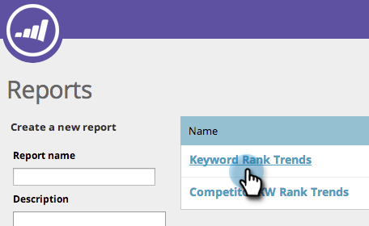

# SEO — 使用关键词趋势报表 {#seo-use-the-keyword-trends-report}

在此报表中，您可以查看一段时间内关键词的排名情况。

## 加载报表 {#load-report}

1. 转到 **报表**.

   

1. 单击 **关键词排名趋势**.

   

   以下是：

   

   描述的报表项：

   | 项目 | 描述 |
   |---|---|
   | 关键词 | 您跟踪的关键词数。 |
   | 排名URL | 您网站上在您设置的范围内排名的URL数。 |
   | 平均 排名 | 在您设置的范围中关键词的平均排名。 |
   | 平均 搜索 | 在您设置的范围(最近30天，在Google美国搜索)内发生的对这些关键词的平均搜索次数 |

## 过滤数据 {#filtering-data}

1. 单击下拉列表，然后选择所需的时间段。

   

1. 单击排名下拉列表以选择要查看关键词的排名范围。

   

## 导出数据 {#exporting-data}

>[!TIP]
>
>您可以将此报表导出到桌面。

1. 单击导出CSV或Export PDF。

   

   干得好！ 您还可以在关键词排名中查看与竞争对手的比较情况。

   >[!NOTE]
   >
   >[使用竞争KW排名趋势报告](/help/marketo/product-docs/additional-apps/seo/reports/seo-use-the-competitor-kw-trends-report.md)
